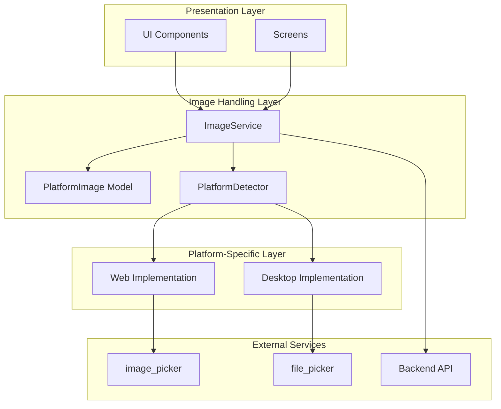
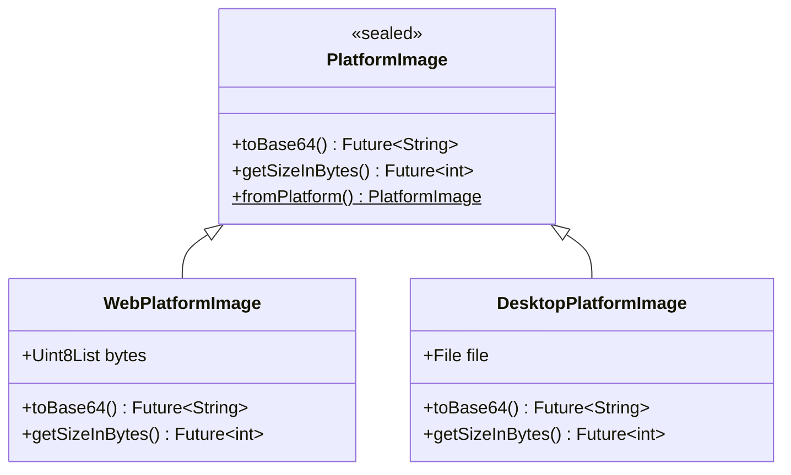

# Design Document: Cross-Platform Image Handling

## Overview

This design document specifies the architecture and implementation strategy for cross-platform image handling in the Flutter application. The system provides a unified abstraction layer that seamlessly handles image selection, storage, display, and upload across web browsers and desktop platforms (Windows, macOS, Linux).

### Problem Statement

The current implementation uses platform-specific APIs (`dart:io` File class) that fail on web platforms with "Unsupported operation: _Namespace" errors. This occurs because:

1. **Web Platform Limitations**: Web browsers don't have direct filesystem access
2. **File API Differences**: Desktop uses file paths, web uses in-memory bytes
3. **Inconsistent Implementations**: Each feature (AI consultation, profile photos, certificates) handles images differently
4. **No Abstraction Layer**: Direct coupling to platform-specific APIs throughout the codebase

### Solution Approach

We will create a **Platform-Aware Image Handling System** that:

1. **Detects Platform**: Uses Flutter's `kIsWeb` constant to determine runtime environment
2. **Abstracts Storage**: Provides unified interface for storing images (bytes on web, paths on desktop)
3. **Handles Display**: Automatically selects correct Image widget based on platform
4. **Manages Upload**: Converts images to base64 for API transmission regardless of platform
5. **Maintains Compatibility**: Works with existing backend APIs without modifications

### Key Design Principles

- **Platform Transparency**: Consumers don't need to know which platform they're running on
- **Type Safety**: Use sealed classes and pattern matching for compile-time safety
- **Minimal Changes**: Update existing code with minimal refactoring
- **Performance**: Avoid unnecessary conversions and memory copies
- **Error Handling**: Provide clear, user-friendly error messages

## Architecture

### High-Level Architecture



### Component Responsibilities

| Component | Responsibility |
|-----------|---------------|
| **PlatformImage** | Sealed class representing an image on any platform |
| **ImageService** | High-level API for image operations (select, display, upload) |
| **PlatformDetector** | Determines runtime platform using `kIsWeb` |
| **WebImageHandler** | Web-specific implementation using bytes |
| **DesktopImageHandler** | Desktop-specific implementation using file paths |
| **ImageDisplayWidget** | Platform-aware widget for displaying images |
| **Base64Encoder** | Converts images to base64 for API transmission |

## Components and Interfaces

### 1. PlatformImage (Sealed Class)

**Purpose**: Type-safe representation of an image that can be either web-based (bytes) or desktop-based (file path).

**Location**: `lib/core/models/platform_image.dart`

```dart
import 'dart:io';
import 'dart:typed_data';
import 'package:flutter/foundation.dart';

/// Sealed class representing an image on any platform
/// 
/// Use pattern matching to handle platform-specific cases:
/// ```dart
/// switch (image) {
///   case WebPlatformImage(:final bytes):
///     // Handle web image
///   case DesktopPlatformImage(:final file):
///     // Handle desktop image
/// }
/// ```
@immutable
sealed class PlatformImage {
  const PlatformImage();
  
  /// Creates a PlatformImage from the current platform
  factory PlatformImage.fromPlatform({
    Uint8List? bytes,
    File? file,
  }) {
    if (kIsWeb) {
      if (bytes == null) {
        throw ArgumentError('bytes must be provided for web platform');
      }
      return WebPlatformImage(bytes);
    } else {
      if (file == null) {
        throw ArgumentError('file must be provided for desktop platform');
      }
      return DesktopPlatformImage(file);
    }
  }
  
  /// Converts this image to base64 string for API transmission
  Future<String> toBase64();
  
  /// Gets the size of the image in bytes
  Future<int> getSizeInBytes();
}

/// Web platform image stored as bytes in memory
@immutable
final class WebPlatformImage extends PlatformImage {
  final Uint8List bytes;
  
  const WebPlatformImage(this.bytes);
  
  @override
  Future<String> toBase64() async {
    return base64Encode(bytes);
  }
  
  @override
  Future<int> getSizeInBytes() async {
    return bytes.length;
  }
  
  @override
  bool operator ==(Object other) =>
      identical(this, other) ||
      other is WebPlatformImage &&
          runtimeType == other.runtimeType &&
          listEquals(bytes, other.bytes);
  
  @override
  int get hashCode => bytes.hashCode;
}

/// Desktop platform image stored as file path
@immutable
final class DesktopPlatformImage extends PlatformImage {
  final File file;
  
  const DesktopPlatformImage(this.file);
  
  @override
  Future<String> toBase64() async {
    final bytes = await file.readAsBytes();
    return base64Encode(bytes);
  }
  
  @override
  Future<int> getSizeInBytes() async {
    return await file.length();
  }
  
  @override
  bool operator ==(Object other) =>
      identical(this, other) ||
      other is DesktopPlatformImage &&
          runtimeType == other.runtimeType &&
          file.path == other.file.path;
  
  @override
  int get hashCode => file.path.hashCode;
}
```

### 2. ImageService

**Purpose**: High-level service for all image operations. Provides platform-agnostic API for selecting, displaying, and uploading images.

**Location**: `lib/core/services/image_service.dart`

```dart
import 'dart:io';
import 'dart:typed_data';
import 'package:flutter/foundation.dart';
import 'package:image_picker/image_picker.dart';
import 'package:file_picker/file_picker.dart';
import '../models/platform_image.dart';

/// Result of image selection operation
@immutable
class ImageSelectionResult {
  final PlatformImage? image;
  final bool wasCancelled;
  final String? errorMessage;
  
  const ImageSelectionResult({
    this.image,
    this.wasCancelled = false,
    this.errorMessage,
  });
  
  bool get isSuccess => image != null;
  bool get hasError => errorMessage != null;
}

/// Service for platform-agnostic image operations
class ImageService {
  final ImagePicker _imagePicker = ImagePicker();
  
  /// Selects an image from the device
  /// 
  /// On web: Uses image_picker with bytes
  /// On desktop: Uses file_picker with file paths
  /// 
  /// Returns [ImageSelectionResult] with the selected image or error
  Future<ImageSelectionResult> selectImage({
    ImageSource source = ImageSource.gallery,
  }) async {
    try {
      if (kIsWeb) {
        return await _selectImageWeb(source);
      } else {
        return await _selectImageDesktop(source);
      }
    } catch (e) {
      return ImageSelectionResult(
        errorMessage: 'Failed to select image: ${e.toString()}',
      );
    }
  }
  
  /// Web-specific image selection
  Future<ImageSelectionResult> _selectImageWeb(ImageSource source) async {
    final XFile? xFile = await _imagePicker.pickImage(source: source);
    
    if (xFile == null) {
      return const ImageSelectionResult(wasCancelled: true);
    }
    
    // Read bytes for web platform
    final Uint8List bytes = await xFile.readAsBytes();
    final image = WebPlatformImage(bytes);
    
    return ImageSelectionResult(image: image);
  }
  
  /// Desktop-specific image selection
  Future<ImageSelectionResult> _selectImageDesktop(ImageSource source) async {
    if (source == ImageSource.camera) {
      // Use image_picker for camera on desktop
      final XFile? xFile = await _imagePicker.pickImage(source: source);
      
      if (xFile == null) {
        return const ImageSelectionResult(wasCancelled: true);
      }
      
      final file = File(xFile.path);
      final image = DesktopPlatformImage(file);
      
      return ImageSelectionResult(image: image);
    } else {
      // Use file_picker for gallery on desktop (better UX)
      final FilePickerResult? result = await FilePicker.platform.pickFiles(
        type: FileType.image,
        allowMultiple: false,
      );
      
      if (result == null || result.files.isEmpty) {
        return const ImageSelectionResult(wasCancelled: true);
      }
      
      final filePath = result.files.first.path;
      if (filePath == null) {
        return const ImageSelectionResult(
          errorMessage: 'Failed to get file path',
        );
      }
      
      final file = File(filePath);
      final image = DesktopPlatformImage(file);
      
      return ImageSelectionResult(image: image);
    }
  }
  
  /// Converts an image to base64 for API transmission
  Future<String> imageToBase64(PlatformImage image) async {
    return await image.toBase64();
  }
  
  /// Gets the size of an image in bytes
  Future<int> getImageSize(PlatformImage image) async {
    return await image.getSizeInBytes();
  }
}
```

### 3. ImageDisplayWidget

**Purpose**: Platform-aware widget that automatically displays images correctly on web and desktop.

**Location**: `lib/core/widgets/image_display_widget.dart`

```dart
import 'dart:io';
import 'package:flutter/material.dart';
import '../models/platform_image.dart';

/// Platform-aware widget for displaying images
/// 
/// Automatically uses:
/// - Image.memory() for web platform
/// - Image.file() for desktop platform
class ImageDisplayWidget extends StatelessWidget {
  final PlatformImage image;
  final BoxFit fit;
  final double? width;
  final double? height;
  final Widget? errorWidget;
  final Widget? loadingWidget;
  
  const ImageDisplayWidget({
    super.key,
    required this.image,
    this.fit = BoxFit.contain,
    this.width,
    this.height,
    this.errorWidget,
    this.loadingWidget,
  });
  
  @override
  Widget build(BuildContext context) {
    return switch (image) {
      WebPlatformImage(:final bytes) => Image.memory(
          bytes,
          fit: fit,
          width: width,
          height: height,
          errorBuilder: (context, error, stackTrace) =>
              errorWidget ?? _defaultErrorWidget(context),
          loadingBuilder: (context, child, loadingProgress) {
            if (loadingProgress == null) return child;
            return loadingWidget ?? _defaultLoadingWidget(context);
          },
        ),
      DesktopPlatformImage(:final file) => Image.file(
          file,
          fit: fit,
          width: width,
          height: height,
          errorBuilder: (context, error, stackTrace) =>
              errorWidget ?? _defaultErrorWidget(context),
        ),
    };
  }
  
  Widget _defaultErrorWidget(BuildContext context) {
    return Center(
      child: Column(
        mainAxisAlignment: MainAxisAlignment.center,
        children: [
          Icon(
            Icons.error_outline,
            size: 48,
            color: Theme.of(context).colorScheme.error,
          ),
          const SizedBox(height: 8),
          Text(
            'Failed to load image',
            style: TextStyle(
              color: Theme.of(context).colorScheme.error,
            ),
          ),
        ],
      ),
    );
  }
  
  Widget _defaultLoadingWidget(BuildContext context) {
    return const Center(
      child: CircularProgressIndicator(),
    );
  }
}
```

### 4. Updated State Models

**Purpose**: Update existing state models to use `PlatformImage` instead of `File`.

**Location**: `lib/presentation/panels/customer/ai_consultation/state/current_consultation_state.dart`

```dart
import 'package:flutter/foundation.dart';
import '../../../../../../core/models/platform_image.dart';
import '../../../../../../data/models/ai_consultation_models.dart';

/// State for the current consultation being created
@immutable
class CurrentConsultationState {
  /// The selected image (platform-aware)
  final PlatformImage? image;

  /// List of markers placed on the image
  final List<DefectMarkerModel> markers;

  /// Whether the consultation is being submitted
  final bool isSubmitting;

  /// Error message if submission failed
  final String? error;

  /// The created consultation (after successful submission)
  final AIConsultationModel? consultation;

  /// Whether the consultation was successfully created
  final bool isCompleted;

  const CurrentConsultationState({
    this.image,
    this.markers = const [],
    this.isSubmitting = false,
    this.error,
    this.consultation,
    this.isCompleted = false,
  });

  /// Initial state
  factory CurrentConsultationState.initial() => const CurrentConsultationState();

  /// Copy with method for immutable updates
  CurrentConsultationState copyWith({
    PlatformImage? image,
    List<DefectMarkerModel>? markers,
    bool? isSubmitting,
    String? error,
    AIConsultationModel? consultation,
    bool? isCompleted,
    bool clearError = false,
    bool clearImage = false,
    bool clearConsultation = false,
  }) {
    return CurrentConsultationState(
      image: clearImage ? null : (image ?? this.image),
      markers: markers ?? this.markers,
      isSubmitting: isSubmitting ?? this.isSubmitting,
      error: clearError ? null : (error ?? this.error),
      consultation: clearConsultation ? null : (consultation ?? this.consultation),
      isCompleted: isCompleted ?? this.isCompleted,
    );
  }

  /// Check if image is selected
  bool get hasImage => image != null;

  /// Check if markers are added
  bool get hasMarkers => markers.isNotEmpty;

  /// Check if ready to submit (has image and at least one marker)
  bool get canSubmit => hasImage && hasMarkers && !isSubmitting;

  /// Get marker count
  int get markerCount => markers.length;

  /// Check if maximum markers reached (10)
  bool get hasMaxMarkers => markers.length >= 10;

  /// Check if has error
  bool get hasError => error != null;

  @override
  bool operator ==(Object other) =>
      identical(this, other) ||
      other is CurrentConsultationState &&
          runtimeType == other.runtimeType &&
          image == other.image &&
          listEquals(markers, other.markers) &&
          isSubmitting == other.isSubmitting &&
          error == other.error &&
          consultation == other.consultation &&
          isCompleted == other.isCompleted;

  @override
  int get hashCode => Object.hash(
        image,
        markers,
        isSubmitting,
        error,
        consultation,
        isCompleted,
      );

  @override
  String toString() =>
      'CurrentConsultationState(hasImage: $hasImage, markerCount: $markerCount, isSubmitting: $isSubmitting, hasError: $hasError, isCompleted: $isCompleted)';
}
```

## Data Models

### PlatformImage Sealed Class Hierarchy



### ImageSelectionResult

```dart
class ImageSelectionResult {
  final PlatformImage? image;      // Selected image (null if cancelled or error)
  final bool wasCancelled;         // True if user cancelled selection
  final String? errorMessage;      // Error message if selection failed
  
  bool get isSuccess;              // True if image was selected
  bool get hasError;               // True if error occurred
}
```

### State Model Updates

All state models that currently use `File` will be updated to use `PlatformImage`:

1. **CurrentConsultationState**: `File? imageFile` → `PlatformImage? image`
2. **Profile state models**: Any `File` fields → `PlatformImage` fields

## Implementation Strategy

### Phase 1: Core Infrastructure

1. **Create PlatformImage sealed class** (`lib/core/models/platform_image.dart`)
   - Define sealed class with web and desktop variants
   - Implement `toBase64()` and `getSizeInBytes()` methods
   - Add factory constructor for platform detection

2. **Create ImageService** (`lib/core/services/image_service.dart`)
   - Implement platform-aware image selection
   - Add base64 conversion methods
   - Handle errors and cancellations

3. **Create ImageDisplayWidget** (`lib/core/widgets/image_display_widget.dart`)
   - Implement platform-aware display logic
   - Add error and loading states
   - Support customization (fit, size, etc.)

### Phase 2: Update Existing Features

#### AI Visual Assistant

**Files to Update**:
- `lib/presentation/panels/customer/ai_consultation/state/current_consultation_state.dart`
- `lib/presentation/panels/customer/ai_consultation/screens/image_capture_screen.dart`
- `lib/presentation/panels/customer/ai_consultation/widgets/annotation_canvas.dart`
- `lib/services/api/ai_consultation_api_service.dart`

**Changes**:
1. Update `CurrentConsultationState` to use `PlatformImage`
2. Update `ImageCaptureScreen` to use `ImageService.selectImage()`
3. Update `AnnotationCanvas` to use `ImageDisplayWidget`
4. Update API service to use `ImageService.imageToBase64()`

#### Customer Profile

**Files to Update**:
- `lib/presentation/panels/customer/screens/edit_profile_screen.dart`
- `lib/data/repositories/user_repository.dart`

**Changes**:
1. Update profile screen to use `ImageService.selectImage()`
2. Update repository to accept `PlatformImage` and convert to base64
3. Update display logic to use `ImageDisplayWidget`

#### Provider Profile

**Files to Update**:
- `lib/features/provider_panel/presentation/screens/provider_profile_screen.dart`
- `lib/features/provider_panel/data/services/provider_upload_service.dart`

**Changes**:
1. Update profile screen to use `ImageService.selectImage()`
2. Update upload service to accept `PlatformImage`
3. Update display logic to use `ImageDisplayWidget`

### Phase 3: Testing and Validation

1. **Unit Tests**: Test `PlatformImage` and `ImageService` on both platforms
2. **Integration Tests**: Test image flow end-to-end
3. **Manual Testing**: Verify on web (Chrome) and desktop (Windows)

## Error Handling

### Error Categories

| Error Type | Handling Strategy |
|------------|------------------|
| **Selection Cancelled** | Return `ImageSelectionResult` with `wasCancelled = true`, no error message |
| **Permission Denied** | Show dialog explaining permission requirement, offer to open settings |
| **Invalid Image** | Show error dialog with specific validation failure |
| **Upload Failed** | Show error with backend message, allow retry |
| **Platform Error** | Log error, show generic user-friendly message |

### Error Messages

**User-Facing Messages** (no platform details):
- "Failed to select image. Please try again."
- "Failed to upload image. Please check your connection and try again."
- "Image could not be loaded. Please select a different image."

**Developer Logs** (include platform details):
- "Web platform: Failed to read image bytes: [error]"
- "Desktop platform: File not found at path: [path]"
- "Unsupported platform detected: [platform]"

### Error Recovery

1. **Automatic Retry**: For transient network errors during upload
2. **User Retry**: Provide "Try Again" button for failed operations
3. **Fallback**: If compression fails, use original image
4. **Graceful Degradation**: If image display fails, show placeholder

## Testing Strategy

### Why Property-Based Testing is Not Used

**Property-based testing (PBT) is NOT applicable to this feature** because it falls into multiple categories where PBT is explicitly not recommended:

1. **Platform Abstraction**: Core functionality is platform detection and routing (configuration logic, not algorithmic)
2. **UI Rendering**: Image display involves UI components (better tested with snapshot/visual regression tests)
3. **External Dependencies**: Heavy reliance on `image_picker` and `file_picker` packages
4. **File I/O Operations**: Side effects involving filesystem and browser APIs
5. **Integration Focus**: Primary value is cross-platform integration, not universal properties across inputs

**Testing Approach**: This feature uses **unit tests** for pure functions, **integration tests** for end-to-end flows, and **manual testing** for cross-platform validation.

### Unit Tests

**PlatformImage Tests** (`test/core/models/platform_image_test.dart`):
- Test `WebPlatformImage.toBase64()` returns correct base64 string for known byte arrays
- Test `DesktopPlatformImage.toBase64()` reads file and returns base64 for test files
- Test `getSizeInBytes()` returns correct size for both platforms
- Test equality and hashCode implementations with specific examples
- Test factory constructor selects correct platform variant

**ImageService Tests** (`test/core/services/image_service_test.dart`):
- Test `selectImage()` returns correct result on web platform (mocked)
- Test `selectImage()` returns correct result on desktop platform (mocked)
- Test `selectImage()` handles cancellation correctly
- Test `selectImage()` handles errors correctly
- Test `imageToBase64()` converts images correctly with known inputs

**ImageDisplayWidget Tests** (`test/core/widgets/image_display_widget_test.dart`):
- Test widget renders correctly for `WebPlatformImage`
- Test widget renders correctly for `DesktopPlatformImage`
- Test error widget displays when image fails to load
- Test loading widget displays during image load

### Integration Tests

**AI Visual Assistant Flow** (`integration_test/ai_consultation_test.dart`):
- Test selecting image from gallery on web
- Test selecting image from gallery on desktop
- Test annotating image with markers
- Test submitting consultation with image
- Test error handling when image selection fails

**Profile Photo Flow** (`integration_test/profile_photo_test.dart`):
- Test uploading profile photo on web
- Test uploading profile photo on desktop
- Test displaying uploaded photo
- Test error handling when upload fails

**Certificate Upload Flow** (`integration_test/certificate_upload_test.dart`):
- Test uploading certificate on web
- Test uploading certificate on desktop
- Test displaying certificate preview

### Manual Testing Checklist

**Web Platform (Chrome)**:
- [ ] Select image from gallery in AI Visual Assistant
- [ ] Annotate image and submit consultation
- [ ] Upload customer profile photo
- [ ] Upload provider profile photo
- [ ] Upload provider certificate
- [ ] Verify no "Unsupported operation" errors
- [ ] Test with various image formats (PNG, JPEG, WebP)
- [ ] Test with different image sizes (small, medium, large)

**Desktop Platform (Windows)**:
- [ ] Select image from gallery in AI Visual Assistant
- [ ] Take photo with camera (if available)
- [ ] Annotate image and submit consultation
- [ ] Upload customer profile photo
- [ ] Upload provider profile photo
- [ ] Upload provider certificate
- [ ] Verify images display correctly
- [ ] Test with various image formats (PNG, JPEG, BMP, GIF)
- [ ] Test with different image sizes (small, medium, large)

**Cross-Platform Consistency**:
- [ ] Verify same image displays identically on web and desktop
- [ ] Verify upload produces same base64 output on both platforms
- [ ] Verify error messages are consistent across platforms
- [ ] Verify UI/UX is consistent across platforms

## Performance Considerations

### Memory Management

**Web Platform**:
- Images stored as `Uint8List` in memory
- Consider image size limits (recommend < 10MB for web)
- Clear image bytes when no longer needed

**Desktop Platform**:
- Images stored as file paths (minimal memory)
- No size restrictions (handled by backend)
- File cleanup handled by OS

### Optimization Strategies

1. **Lazy Loading**: Only load image bytes when needed for display or upload
2. **Compression**: Use existing compression logic in upload services
3. **Caching**: Cache base64 conversions to avoid repeated encoding
4. **Disposal**: Clear image references when widgets are disposed

### Performance Metrics

| Operation | Web Target | Desktop Target |
|-----------|-----------|---------------|
| Image Selection | < 1s | < 500ms |
| Image Display | < 500ms | < 200ms |
| Base64 Conversion | < 2s | < 1s |
| Upload (1MB image) | < 5s | < 3s |

## Migration Guide

### For Developers

**Before** (Desktop-only code):
```dart
// Old code - fails on web
File? imageFile;

Future<void> pickImage() async {
  final picker = ImagePicker();
  final xFile = await picker.pickImage(source: ImageSource.gallery);
  if (xFile != null) {
    imageFile = File(xFile.path);  // ❌ Fails on web
  }
}

Widget buildImage() {
  return Image.file(imageFile!);  // ❌ Fails on web
}
```

**After** (Cross-platform code):
```dart
// New code - works on web and desktop
PlatformImage? image;
final imageService = ImageService();

Future<void> pickImage() async {
  final result = await imageService.selectImage(
    source: ImageSource.gallery,
  );
  
  if (result.isSuccess) {
    image = result.image;  // ✅ Works on both platforms
  } else if (result.hasError) {
    // Handle error
  }
}

Widget buildImage() {
  return ImageDisplayWidget(image: image!);  // ✅ Works on both platforms
}
```

### Migration Checklist

For each file using `File` for images:

1. [ ] Import `PlatformImage` and `ImageService`
2. [ ] Replace `File?` with `PlatformImage?`
3. [ ] Replace image picker code with `ImageService.selectImage()`
4. [ ] Replace `Image.file()` with `ImageDisplayWidget`
5. [ ] Update base64 conversion to use `ImageService.imageToBase64()`
6. [ ] Test on both web and desktop platforms

## Security Considerations

### Input Validation

1. **File Type Validation**: Accept only image MIME types
2. **Size Validation**: Backend enforces size limits (no frontend restrictions per requirements)
3. **Content Validation**: Backend scans for malicious content

### Data Protection

1. **In-Memory Storage**: Web images stored in memory only (not persisted)
2. **Temporary Files**: Desktop images cleaned up after upload
3. **Secure Transmission**: Images transmitted over HTTPS
4. **Base64 Encoding**: Standard encoding, no encryption (handled by HTTPS)

### Privacy

1. **Permission Requests**: Request camera/gallery permissions with clear explanations
2. **User Consent**: Users explicitly select images (no automatic capture)
3. **Data Retention**: Images deleted after consultation completion (backend policy)

## Deployment Considerations

### Dependencies

**Required Packages**:
- `image_picker: ^1.0.0` - For camera and gallery access
- `file_picker: ^6.0.0` - For desktop file selection
- `permission_handler: ^11.0.0` - For permission management

**No New Dependencies**: All required packages already in `pubspec.yaml`

### Platform Configuration

**Web** (`web/index.html`):
- No additional configuration required
- File input handled by browser

**Desktop** (Windows, macOS, Linux):
- No additional configuration required
- Native file dialogs provided by OS

### Build Configuration

**Web Build**:
```bash
flutter build web --release
```

**Desktop Build**:
```bash
flutter build windows --release
flutter build macos --release
flutter build linux --release
```

### Rollout Strategy

1. **Phase 1**: Deploy to staging environment
2. **Phase 2**: Test on web and desktop platforms
3. **Phase 3**: Deploy to production with monitoring
4. **Phase 4**: Monitor error rates and user feedback

## Appendix

### File Structure

```
lib/
├── core/
│   ├── models/
│   │   └── platform_image.dart          # NEW: Sealed class for images
│   ├── services/
│   │   └── image_service.dart           # NEW: Image operations service
│   └── widgets/
│       └── image_display_widget.dart    # NEW: Platform-aware display widget
├── presentation/
│   └── panels/
│       └── customer/
│           ├── ai_consultation/
│           │   ├── state/
│           │   │   └── current_consultation_state.dart  # UPDATED
│           │   ├── screens/
│           │   │   └── image_capture_screen.dart        # UPDATED
│           │   └── widgets/
│           │       └── annotation_canvas.dart           # UPDATED
│           └── screens/
│               └── edit_profile_screen.dart             # UPDATED
├── features/
│   └── provider_panel/
│       ├── presentation/
│       │   └── screens/
│       │       └── provider_profile_screen.dart         # UPDATED
│       └── data/
│           └── services/
│               └── provider_upload_service.dart         # UPDATED
├── data/
│   └── repositories/
│       └── user_repository.dart                         # UPDATED
└── services/
    └── api/
        └── ai_consultation_api_service.dart             # UPDATED
```

### API Compatibility

**Current Backend Endpoints** (no changes required):
- `POST /v1/customer/ai/consultations` - Accepts base64 image
- `POST /v1/profile/image` - Accepts multipart file upload
- `POST /v1/provider/certifications/upload` - Accepts multipart file upload

**Request Format** (unchanged):
```json
{
  "image": "base64_encoded_string",
  "markers": [...]
}
```

### References

- [Flutter Web Support](https://docs.flutter.dev/platform-integration/web)
- [image_picker Package](https://pub.dev/packages/image_picker)
- [file_picker Package](https://pub.dev/packages/file_picker)
- [Dart Sealed Classes](https://dart.dev/language/class-modifiers#sealed)
- [Flutter Platform Detection](https://api.flutter.dev/flutter/foundation/kIsWeb-constant.html)
