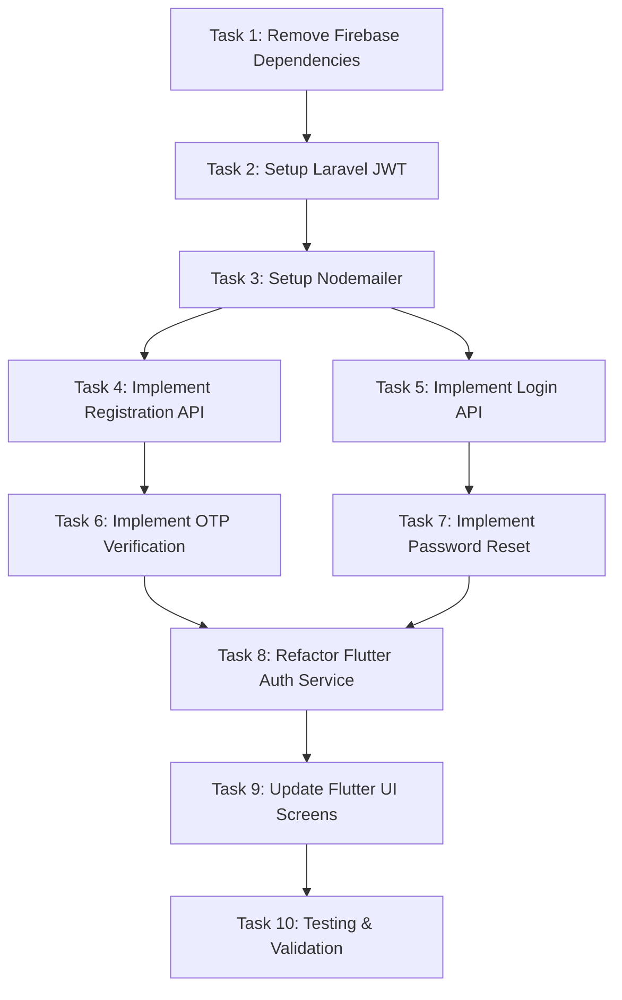

# Implementation Plan: Laravel JWT + Nodemailer Authentication Migration

## Overview

This plan migrates the authentication system from Firebase to Laravel JWT with Nodemailer for email delivery. The migration removes all Firebase dependencies and implements a complete JWT-based authentication system with real email OTP verification.

## Task Dependency Graph

```json
{
  "waves": [
    {"wave": 1, "tasks": [1]},
    {"wave": 2, "tasks": [2]},
    {"wave": 3, "tasks": [3]},
    {"wave": 4, "tasks": [4, 5]},
    {"wave": 5, "tasks": [6, 7]},
    {"wave": 6, "tasks": [8]},
    {"wave": 7, "tasks": [9]},
    {"wave": 8, "tasks": [10]}
  ]
}
```



## Tasks

- [x] 1. Remove Firebase Dependencies (Requirement 1) - 2 hours
  - Remove Firebase packages from Flutter (pubspec.yaml: firebase_core, firebase_auth)
  - Delete Firebase config files (google-services.json, GoogleService-Info.plist, firebase_options.dart)
  - Remove Firebase initialization from lib/main.dart
  - Remove Firebase packages from Laravel (composer remove kreait/firebase-php)
  - Delete backend/storage/app/firebase-credentials.json
  - Remove Firebase code from AuthController

- [x] 2. Setup Laravel JWT Authentication (Requirement 2) - 4 hours

  - Install tymon/jwt-auth package
  - Update User model to implement JWTSubject interface
  - Create JwtAuthController with register, login, logout, refresh, me methods
  - Create JWT middleware for token validation
  - Create refresh_tokens table migration

- [x] 3. Setup Laravel Mail for Real-Time OTP Delivery (Requirement 3) - 3 hours
  - Configure Laravel Mail with Gmail SMTP
  - Update OtpController to use Laravel Mail
  - Verify email templates work with Laravel Mail
  - Test real-time OTP delivery to Gmail
  - Document Gmail App Password setup

- [x] 4. Implement Registration API (Requirement 7) - 3 hours
  - Create registration endpoint in JwtAuthController
  - Add validation for name, email, password
  - Generate and send OTP via Nodemailer
  - Return success response with user_id
  - Update API routes

- [ ] 5. Implement Login API (Requirement 8) - 2 hours
  - Create login endpoint with credential verification
  - Generate JWT access and refresh tokens
  - Implement rate limiting (5 attempts per 15 minutes)
  - Update last_login_at timestamp
  - Return tokens in response

- [ ] 6. Implement OTP Verification (Requirement 4) - 2 hours
  - Update OtpController@verifyEmailOtp to return JWT tokens
  - Mark email as verified in Laravel database
  - Remove Firebase email verification code
  - Generate JWT tokens after successful verification

- [ ] 7. Implement Password Reset (Requirement 5) - 2 hours
  - Update OtpController@resetPassword to update Laravel password
  - Remove Firebase password update code
  - Invalidate all refresh tokens on password change
  - Send password changed confirmation email

- [ ] 8. Refactor Flutter Auth Service (Requirement 6) - 4 hours
  - Create lib/services/auth/jwt_auth_service.dart
  - Implement register, login, logout, refreshToken methods
  - Create TokenInterceptor for automatic token refresh
  - Update auth state provider to use JWT auth
  - Implement secure token storage

- [ ] 9. Update Flutter UI Screens (Requirements 7, 8) - 3 hours
  - Update login_screen.dart to use JWT auth service
  - Update registration flow to work with JWT backend
  - Verify OTP screens work with new backend
  - Update password reset screens
  - Remove Firebase-specific code

- [ ] 10. Testing & Validation (All requirements) - 4 hours
  - Test all backend API endpoints
  - Test Flutter authentication flows end-to-end
  - Verify email sending works
  - Test token refresh mechanism
  - Test rate limiting and security measures
  - Verify error handling

## Notes

**Total Estimated Time:** 31 hours

**Critical Path:**
Remove Firebase → Setup JWT → Setup Nodemailer → Implement APIs → Refactor Flutter → Testing

**Key Files:**
- Backend: `app/Http/Controllers/API/V1/Auth/JwtAuthController.php`, `app/Services/NodemailerService.php`, `backend/scripts/send-email.js`
- Flutter: `lib/services/auth/jwt_auth_service.dart`, `lib/services/api/token_interceptor.dart`
- Config: `backend/.env` (SMTP settings), `backend/config/jwt.php`

**Testing Strategy:**
1. Test each backend endpoint with Postman/curl
2. Verify email delivery in real inbox
3. Test Flutter flows on emulator/device
4. Verify token refresh works automatically
5. Test error scenarios (invalid OTP, expired tokens, etc.)

**Total Estimated Time:** 31 hours

**Task Breakdown:**
- Task 1: Remove Firebase Dependencies (2 hours)
- Task 2: Setup Laravel JWT (4 hours)
- Task 3: Setup Nodemailer (3 hours)
- Task 4: Implement Registration API (3 hours)
- Task 5: Implement Login API (2 hours)
- Task 6: Implement OTP Verification (2 hours)
- Task 7: Implement Password Reset (2 hours)
- Task 8: Refactor Flutter Auth Service (4 hours)
- Task 9: Update Flutter UI Screens (3 hours)
- Task 10: Testing & Validation (4 hours)

**Critical Path:**
1. Remove Firebase → Setup JWT → Setup Nodemailer → Implement APIs → Refactor Flutter → Testing

**Dependencies:**
- All tasks depend on Task 1 (Remove Firebase)
- Flutter tasks (8, 9) depend on backend tasks (2-7)
- Testing (10) depends on all previous tasks
