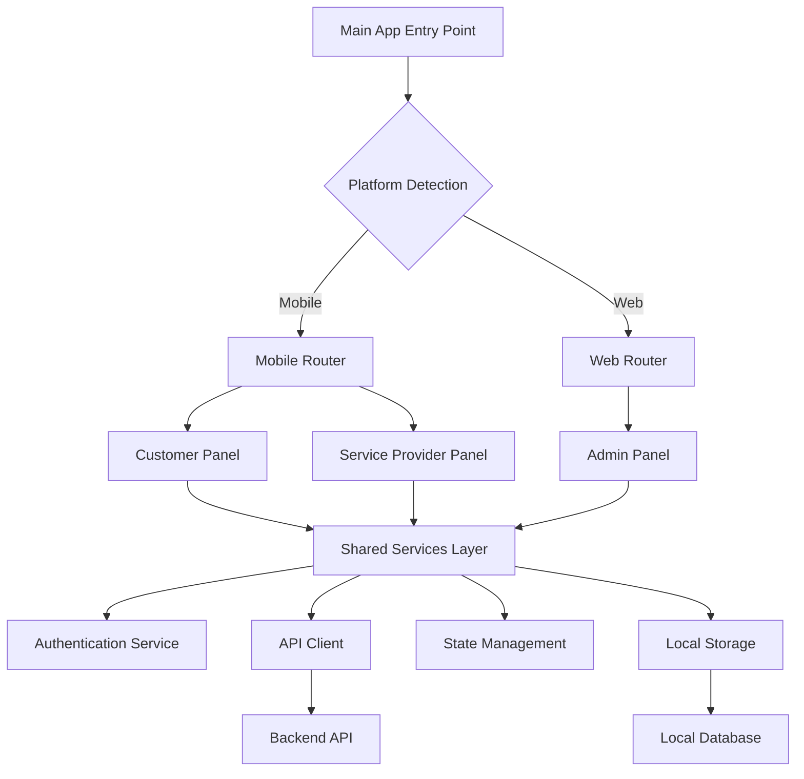
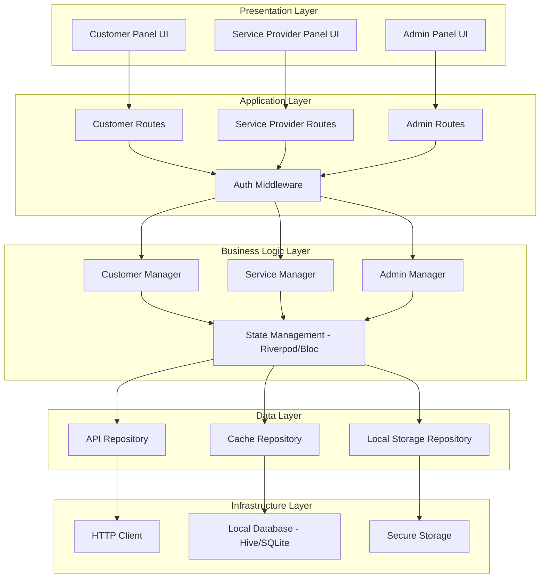
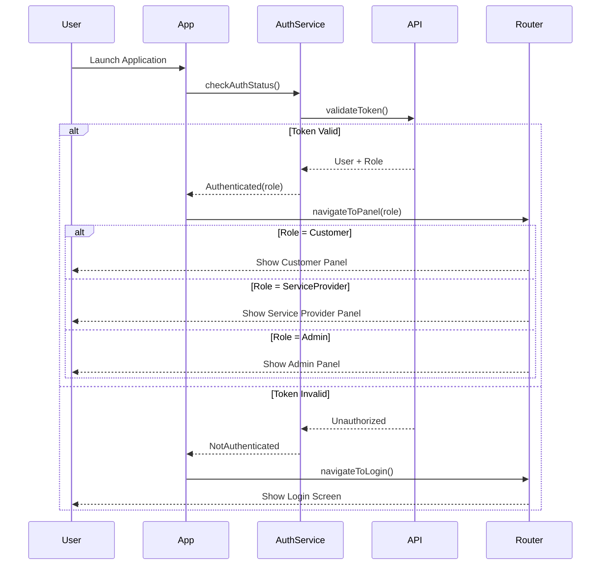
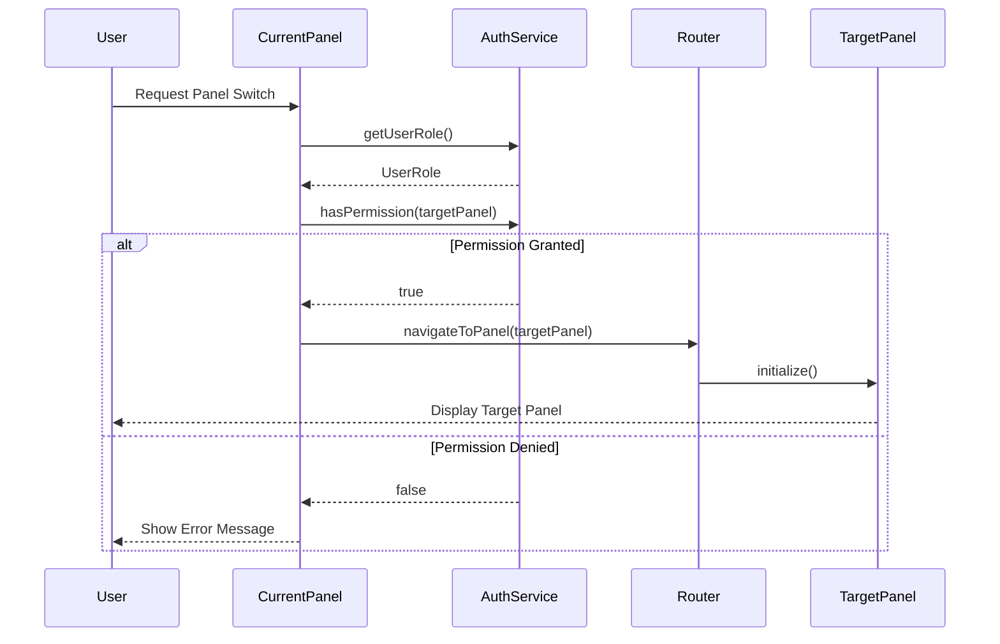
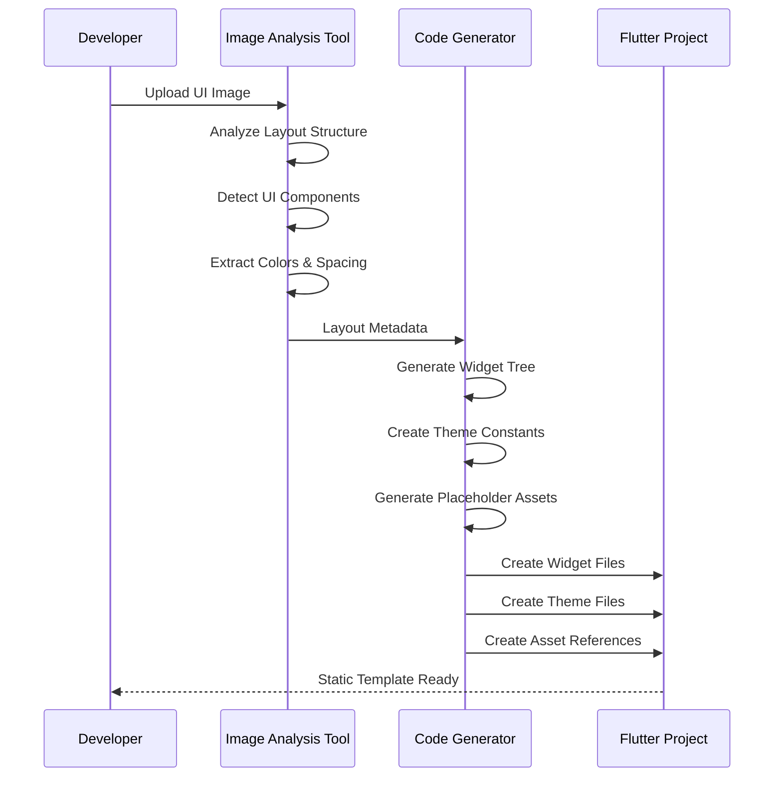

# Design Document: Multi-Panel Flutter Application

## Overview

This design describes a multi-panel Flutter application that supports three distinct user interfaces within a single project: a Customer Panel (mobile), a Service Provider Panel (mobile), and an Admin Panel (web). The architecture leverages Flutter's cross-platform capabilities to deliver native mobile experiences for customers and service providers while providing a responsive web dashboard for administrators. The system implements role-based access control, separate navigation flows, and modular panel architecture to ensure clean separation of concerns. Static Flutter templates will be generated from provided UI images for the customer and service provider interfaces, enabling rapid prototyping and consistent design implementation.

## Architecture

The application follows a modular, role-based architecture with clear separation between panels while sharing common infrastructure components.




### Layered Architecture




## Sequence Diagrams

### User Authentication Flow




### Panel Switching Flow




### Static Template Generation from UI Images




## Components and Interfaces

### Component 1: AppRouter

**Purpose**: Manages navigation and routing for all three panels with role-based access control

**Interface**:
```dart
abstract class AppRouter {
  /// Initialize router with authentication state
  void initialize(AuthenticationState authState);
  
  /// Navigate to appropriate panel based on user role
  Future<void> navigateToPanel(UserRole role);
  
  /// Navigate to login screen
  Future<void> navigateToLogin();
  
  /// Check if user has permission to access a route
  bool canAccessRoute(String route, UserRole role);
  
  /// Get current route configuration
  RouteInformation? get currentConfiguration;
}
```

**Responsibilities**:
- Route management for mobile and web platforms
- Role-based route protection
- Deep linking support
- Navigation state persistence


### Component 2: AuthenticationService

**Purpose**: Handles user authentication, authorization, and session management

**Interface**:
```dart
abstract class AuthenticationService {
  /// Current authentication state stream
  Stream<AuthenticationState> get authStateChanges;
  
  /// Login with credentials
  Future<AuthResult> login(String email, String password, UserRole role);
  
  /// Logout current user
  Future<void> logout();
  
  /// Check if current token is valid
  Future<bool> validateToken();
  
  /// Get current user information
  Future<User?> getCurrentUser();
  
  /// Check if user has specific permission
  bool hasPermission(String permission);
  
  /// Refresh authentication token
  Future<String?> refreshToken();
}
```

**Responsibilities**:
- User authentication and authorization
- Token management and refresh
- Session persistence
- Role-based permission checking


### Component 3: PanelManager

**Purpose**: Manages panel lifecycle, state, and switching between different user interfaces

**Interface**:
```dart
abstract class PanelManager {
  /// Get current active panel
  Panel get currentPanel;
  
  /// Switch to a different panel
  Future<void> switchPanel(PanelType type);
  
  /// Initialize panel with configuration
  Future<void> initializePanel(PanelType type, PanelConfig config);
  
  /// Dispose current panel resources
  Future<void> disposePanel();
  
  /// Check if panel switch is allowed
  bool canSwitchToPanel(PanelType type);
  
  /// Get panel configuration
  PanelConfig getPanelConfig(PanelType type);
}
```

**Responsibilities**:
- Panel lifecycle management
- Panel state preservation
- Resource cleanup on panel switch
- Panel configuration management


### Component 4: CustomerPanel

**Purpose**: Mobile interface for customers to browse and book services

**Interface**:
```dart
abstract class CustomerPanel extends StatefulWidget {
  /// Panel configuration
  final PanelConfig config;
  
  /// Navigation key for customer routes
  final GlobalKey<NavigatorState> navigatorKey;
  
  const CustomerPanel({
    required this.config,
    required this.navigatorKey,
  });
}

abstract class CustomerPanelController {
  /// Load customer dashboard data
  Future<void> loadDashboard();
  
  /// Search for services
  Future<List<Service>> searchServices(String query);
  
  /// Book a service
  Future<BookingResult> bookService(String serviceId, DateTime dateTime);
  
  /// View booking history
  Future<List<Booking>> getBookingHistory();
  
  /// Update customer profile
  Future<void> updateProfile(CustomerProfile profile);
}
```

**Responsibilities**:
- Customer dashboard display
- Service browsing and search
- Booking management
- Profile management


### Component 5: ServiceProviderPanel

**Purpose**: Mobile interface for service providers to manage services and bookings

**Interface**:
```dart
abstract class ServiceProviderPanel extends StatefulWidget {
  /// Panel configuration
  final PanelConfig config;
  
  /// Navigation key for service provider routes
  final GlobalKey<NavigatorState> navigatorKey;
  
  const ServiceProviderPanel({
    required this.config,
    required this.navigatorKey,
  });
}

abstract class ServiceProviderPanelController {
  /// Load service provider dashboard
  Future<void> loadDashboard();
  
  /// Get pending booking requests
  Future<List<BookingRequest>> getPendingRequests();
  
  /// Accept or reject booking request
  Future<void> respondToBooking(String bookingId, bool accept);
  
  /// Manage service offerings
  Future<void> updateServices(List<Service> services);
  
  /// View earnings and analytics
  Future<ProviderAnalytics> getAnalytics(DateRange range);
}
```

**Responsibilities**:
- Service provider dashboard
- Booking request management
- Service offering management
- Analytics and earnings tracking


### Component 6: AdminPanel

**Purpose**: Web dashboard for administrators to manage the entire platform

**Interface**:
```dart
abstract class AdminPanel extends StatefulWidget {
  /// Panel configuration
  final PanelConfig config;
  
  /// Navigation key for admin routes
  final GlobalKey<NavigatorState> navigatorKey;
  
  const AdminPanel({
    required this.config,
    required this.navigatorKey,
  });
}

abstract class AdminPanelController {
  /// Load admin dashboard with statistics
  Future<AdminDashboard> loadDashboard();
  
  /// Manage users (customers and providers)
  Future<void> manageUser(String userId, UserAction action);
  
  /// View and manage all bookings
  Future<List<Booking>> getAllBookings(BookingFilter filter);
  
  /// Generate platform reports
  Future<Report> generateReport(ReportType type, DateRange range);
  
  /// Manage platform settings
  Future<void> updateSettings(PlatformSettings settings);
  
  /// Monitor system health
  Future<SystemHealth> getSystemHealth();
}
```

**Responsibilities**:
- Platform-wide dashboard and analytics
- User management (customers and providers)
- Booking oversight and management
- System configuration and monitoring


### Component 7: TemplateGenerator

**Purpose**: Generate static Flutter widgets from UI images

**Interface**:
```dart
abstract class TemplateGenerator {
  /// Analyze UI image and extract layout information
  Future<LayoutMetadata> analyzeImage(File imageFile);
  
  /// Generate Flutter widget code from layout metadata
  Future<String> generateWidgetCode(LayoutMetadata metadata);
  
  /// Extract color palette from image
  Future<ColorPalette> extractColors(File imageFile);
  
  /// Generate theme configuration
  Future<String> generateThemeCode(ColorPalette palette);
  
  /// Create complete template package
  Future<TemplatePackage> generateTemplate(
    File imageFile,
    TemplateConfig config,
  );
}
```

**Responsibilities**:
- Image analysis and layout detection
- Widget code generation
- Theme extraction and generation
- Template packaging and organization


## Data Models

### Model 1: User

```dart
enum UserRole {
  customer,
  serviceProvider,
  admin,
}

class User {
  final String id;
  final String email;
  final String name;
  final UserRole role;
  final String? phoneNumber;
  final String? profileImageUrl;
  final DateTime createdAt;
  final DateTime? lastLoginAt;
  final bool isActive;
  final Map<String, dynamic> metadata;
  
  const User({
    required this.id,
    required this.email,
    required this.name,
    required this.role,
    this.phoneNumber,
    this.profileImageUrl,
    required this.createdAt,
    this.lastLoginAt,
    required this.isActive,
    this.metadata = const {},
  });
  
  factory User.fromJson(Map<String, dynamic> json);
  Map<String, dynamic> toJson();
}
```

**Validation Rules**:
- `id` must be non-empty UUID string
- `email` must be valid email format
- `name` must be non-empty and 2-100 characters
- `role` must be one of the defined UserRole values
- `phoneNumber` must match valid phone format if provided
- `createdAt` cannot be in the future


### Model 2: AuthenticationState

```dart
enum AuthStatus {
  authenticated,
  unauthenticated,
  loading,
  error,
}

class AuthenticationState {
  final AuthStatus status;
  final User? user;
  final String? token;
  final String? refreshToken;
  final DateTime? tokenExpiry;
  final String? errorMessage;
  
  const AuthenticationState({
    required this.status,
    this.user,
    this.token,
    this.refreshToken,
    this.tokenExpiry,
    this.errorMessage,
  });
  
  bool get isAuthenticated => status == AuthStatus.authenticated;
  bool get isLoading => status == AuthStatus.loading;
  bool get hasError => status == AuthStatus.error;
  bool get tokenExpired => 
    tokenExpiry != null && DateTime.now().isAfter(tokenExpiry!);
  
  AuthenticationState copyWith({
    AuthStatus? status,
    User? user,
    String? token,
    String? refreshToken,
    DateTime? tokenExpiry,
    String? errorMessage,
  });
}
```

**Validation Rules**:
- If `status` is `authenticated`, `user` and `token` must not be null
- If `status` is `error`, `errorMessage` must not be null
- `tokenExpiry` must be in the future when token is valid
- `token` and `refreshToken` must be non-empty strings when present


### Model 3: PanelConfig

```dart
enum PanelType {
  customer,
  serviceProvider,
  admin,
}

class PanelConfig {
  final PanelType type;
  final String title;
  final ThemeData theme;
  final List<String> enabledFeatures;
  final Map<String, dynamic> customSettings;
  final bool isWebSupported;
  final bool isMobileSupported;
  
  const PanelConfig({
    required this.type,
    required this.title,
    required this.theme,
    required this.enabledFeatures,
    this.customSettings = const {},
    required this.isWebSupported,
    required this.isMobileSupported,
  });
  
  factory PanelConfig.customer();
  factory PanelConfig.serviceProvider();
  factory PanelConfig.admin();
}
```

**Validation Rules**:
- `type` must match the panel configuration (customer config has customer type)
- `title` must be non-empty
- `enabledFeatures` must contain valid feature identifiers
- At least one of `isWebSupported` or `isMobileSupported` must be true
- Admin panel must have `isWebSupported` = true


### Model 4: Service

```dart
enum ServiceStatus {
  active,
  inactive,
  pending,
}

class Service {
  final String id;
  final String providerId;
  final String name;
  final String description;
  final String category;
  final double price;
  final String currency;
  final int durationMinutes;
  final ServiceStatus status;
  final List<String> imageUrls;
  final Map<String, dynamic> metadata;
  final DateTime createdAt;
  final DateTime updatedAt;
  
  const Service({
    required this.id,
    required this.providerId,
    required this.name,
    required this.description,
    required this.category,
    required this.price,
    required this.currency,
    required this.durationMinutes,
    required this.status,
    required this.imageUrls,
    this.metadata = const {},
    required this.createdAt,
    required this.updatedAt,
  });
  
  factory Service.fromJson(Map<String, dynamic> json);
  Map<String, dynamic> toJson();
}
```

**Validation Rules**:
- `id` and `providerId` must be non-empty UUID strings
- `name` must be 3-200 characters
- `description` must be 10-2000 characters
- `price` must be non-negative
- `currency` must be valid ISO 4217 code
- `durationMinutes` must be positive (minimum 15 minutes)
- `imageUrls` must contain valid URLs


### Model 5: Booking

```dart
enum BookingStatus {
  pending,
  confirmed,
  inProgress,
  completed,
  cancelled,
}

class Booking {
  final String id;
  final String customerId;
  final String serviceId;
  final String providerId;
  final DateTime scheduledAt;
  final BookingStatus status;
  final double totalPrice;
  final String currency;
  final String? cancellationReason;
  final DateTime createdAt;
  final DateTime updatedAt;
  final Map<String, dynamic> metadata;
  
  const Booking({
    required this.id,
    required this.customerId,
    required this.serviceId,
    required this.providerId,
    required this.scheduledAt,
    required this.status,
    required this.totalPrice,
    required this.currency,
    this.cancellationReason,
    required this.createdAt,
    required this.updatedAt,
    this.metadata = const {},
  });
  
  bool get isPending => status == BookingStatus.pending;
  bool get isActive => status == BookingStatus.confirmed || 
                       status == BookingStatus.inProgress;
  bool get isCompleted => status == BookingStatus.completed;
  bool get isCancelled => status == BookingStatus.cancelled;
  
  factory Booking.fromJson(Map<String, dynamic> json);
  Map<String, dynamic> toJson();
}
```

**Validation Rules**:
- All ID fields must be non-empty UUID strings
- `scheduledAt` must be in the future for new bookings
- `totalPrice` must be non-negative
- `currency` must be valid ISO 4217 code
- If `status` is `cancelled`, `cancellationReason` must not be null
- `createdAt` must be before or equal to `updatedAt`


### Model 6: LayoutMetadata

```dart
enum WidgetType {
  container,
  text,
  button,
  image,
  listView,
  gridView,
  card,
  appBar,
  bottomNav,
  textField,
  unknown,
}

class LayoutMetadata {
  final String id;
  final WidgetType type;
  final Rect bounds;
  final Map<String, dynamic> properties;
  final List<LayoutMetadata> children;
  final LayoutMetadata? parent;
  
  const LayoutMetadata({
    required this.id,
    required this.type,
    required this.bounds,
    required this.properties,
    required this.children,
    this.parent,
  });
  
  factory LayoutMetadata.fromImageAnalysis(Map<String, dynamic> analysis);
  String generateWidgetCode();
}
```

**Validation Rules**:
- `id` must be unique within the layout tree
- `bounds` must have positive width and height
- `children` must not contain circular references
- `properties` must contain valid Flutter widget properties
- Root widget must have `parent` = null


## Algorithmic Pseudocode

### Main Application Initialization Algorithm

```dart
/// Initialize the Flutter application with platform detection and routing
Future<void> initializeApplication() async {
  // PRECONDITION: Flutter framework is initialized
  // POSTCONDITION: Application is ready with appropriate panel loaded
  
  WidgetsFlutterBinding.ensureInitialized();
  
  // Step 1: Initialize core services
  final authService = await AuthenticationService.initialize();
  final storageService = await StorageService.initialize();
  final apiClient = ApiClient.initialize();
  
  // Step 2: Check authentication status
  final authState = await authService.checkAuthStatus();
  
  // Step 3: Determine platform and initial route
  final platform = _detectPlatform();
  final initialRoute = _determineInitialRoute(authState, platform);
  
  // ASSERT: initialRoute is valid for the current platform
  assert(_isValidRouteForPlatform(initialRoute, platform));
  
  // Step 4: Initialize router with configuration
  final router = AppRouter(
    authService: authService,
    initialRoute: initialRoute,
  );
  
  // Step 5: Run application
  runApp(MultiPanelApp(
    router: router,
    authService: authService,
  ));
  
  // POSTCONDITION: App is running with correct panel for user role
}
```

**Preconditions:**
- Flutter framework is properly initialized
- Required permissions are granted (storage, network)
- Device meets minimum requirements

**Postconditions:**
- Application is running
- Appropriate panel is displayed based on user role and platform
- All core services are initialized and ready

**Loop Invariants:** N/A (no loops in main initialization)


### Authentication and Role-Based Routing Algorithm

```dart
/// Authenticate user and navigate to appropriate panel
Future<void> authenticateAndRoute(String email, String password, UserRole role) async {
  // PRECONDITION: email is valid format, password is non-empty, role is valid
  // POSTCONDITION: User is authenticated and navigated to correct panel OR error is shown
  
  try {
    // Step 1: Validate input
    assert(email.isNotEmpty && _isValidEmail(email));
    assert(password.length >= 8);
    assert(role != null);
    
    // Step 2: Attempt authentication
    final authResult = await authService.login(email, password, role);
    
    if (authResult.isSuccess) {
      // Step 3: Store authentication token
      await storageService.saveToken(authResult.token);
      await storageService.saveRefreshToken(authResult.refreshToken);
      
      // Step 4: Load user profile
      final user = await authService.getCurrentUser();
      
      // ASSERT: User role matches requested role
      assert(user.role == role);
      
      // Step 5: Navigate to appropriate panel
      await _navigateToPanel(user.role);
      
      // POSTCONDITION: User is on correct panel
    } else {
      // Handle authentication failure
      throw AuthenticationException(authResult.errorMessage);
    }
  } catch (e) {
    // Log error and show user-friendly message
    logger.error('Authentication failed', error: e);
    _showErrorDialog('Login failed. Please check your credentials.');
  }
}
```

**Preconditions:**
- `email` is non-empty and valid email format
- `password` is at least 8 characters
- `role` is one of the valid UserRole values
- Network connection is available

**Postconditions:**
- If successful: User is authenticated, token is stored, and navigated to correct panel
- If failed: Error message is displayed, user remains on login screen
- No partial authentication state (atomic operation)

**Loop Invariants:** N/A (no loops)


### Panel Navigation Algorithm

```dart
/// Navigate to panel based on user role with permission checking
Future<void> navigateToPanel(UserRole role) async {
  // PRECONDITION: User is authenticated, role is valid
  // POSTCONDITION: User is on the correct panel for their role
  
  // Step 1: Verify authentication
  final isAuthenticated = await authService.validateToken();
  if (!isAuthenticated) {
    await router.navigateToLogin();
    return;
  }
  
  // Step 2: Get current platform
  final platform = _detectPlatform();
  
  // Step 3: Determine target panel and validate platform support
  final panelType = _roleToPanelType(role);
  final panelConfig = panelManager.getPanelConfig(panelType);
  
  // ASSERT: Panel is supported on current platform
  if (platform == Platform.web) {
    assert(panelConfig.isWebSupported, 
      'Panel $panelType not supported on web');
  } else {
    assert(panelConfig.isMobileSupported, 
      'Panel $panelType not supported on mobile');
  }
  
  // Step 4: Initialize panel
  await panelManager.initializePanel(panelType, panelConfig);
  
  // Step 5: Navigate to panel route
  final route = _getPanelRoute(panelType);
  await router.navigateTo(route);
  
  // POSTCONDITION: Current panel matches user role
  assert(panelManager.currentPanel.type == panelType);
}
```

**Preconditions:**
- User is authenticated with valid token
- `role` is a valid UserRole value
- Platform is detected correctly

**Postconditions:**
- User is navigated to the correct panel for their role
- Panel is initialized and ready for interaction
- Navigation stack is properly configured

**Loop Invariants:** N/A (no loops)


### Static Template Generation Algorithm

```dart
/// Generate Flutter widget template from UI image
Future<TemplatePackage> generateTemplateFromImage(
  File imageFile,
  TemplateConfig config,
) async {
  // PRECONDITION: imageFile exists and is valid image format
  // POSTCONDITION: Complete template package is generated with valid Flutter code
  
  // Step 1: Validate input
  assert(await imageFile.exists());
  assert(_isValidImageFormat(imageFile));
  
  // Step 2: Analyze image layout
  final layoutMetadata = await _analyzeImageLayout(imageFile);
  
  // LOOP INVARIANT: All processed widgets have valid metadata
  final widgets = <String>[];
  for (final component in layoutMetadata.components) {
    assert(component.isValid());
    
    // Generate widget code for each component
    final widgetCode = _generateWidgetCode(component);
    widgets.add(widgetCode);
  }
  
  // Step 3: Extract color palette
  final colorPalette = await _extractColors(imageFile);
  
  // Step 4: Generate theme configuration
  final themeCode = _generateThemeCode(colorPalette);
  
  // Step 5: Create template package
  final package = TemplatePackage(
    widgets: widgets,
    theme: themeCode,
    assets: layoutMetadata.assets,
    config: config,
  );
  
  // POSTCONDITION: Package contains valid, compilable Flutter code
  assert(await _validateFlutterCode(package));
  
  return package;
}
```

**Preconditions:**
- `imageFile` exists and is accessible
- Image format is supported (PNG, JPG, SVG)
- `config` contains valid template configuration
- Sufficient memory available for image processing

**Postconditions:**
- Template package is generated with all required files
- Generated code is valid Dart/Flutter syntax
- Theme configuration matches extracted colors
- All assets are properly referenced

**Loop Invariants:**
- All processed components have valid metadata
- Generated widget code is syntactically correct
- Component hierarchy is preserved


## Key Functions with Formal Specifications

### Function 1: checkAuthStatus()

```dart
Future<AuthenticationState> checkAuthStatus() async
```

**Preconditions:**
- Storage service is initialized
- Network connection is available (for token validation)

**Postconditions:**
- Returns valid AuthenticationState object
- If token exists and is valid: `state.status == AuthStatus.authenticated`
- If token is expired: `state.status == AuthStatus.unauthenticated`
- If error occurs: `state.status == AuthStatus.error` with error message
- No side effects on stored credentials

**Loop Invariants:** N/A (no loops)


### Function 2: canAccessRoute()

```dart
bool canAccessRoute(String route, UserRole role)
```

**Preconditions:**
- `route` is non-empty string
- `role` is valid UserRole value
- Route configuration is loaded

**Postconditions:**
- Returns boolean value
- `true` if and only if user with given role can access the route
- No mutations to route configuration
- Deterministic result for same inputs

**Loop Invariants:** N/A (no loops)


### Function 3: switchPanel()

```dart
Future<void> switchPanel(PanelType type)
```

**Preconditions:**
- User is authenticated
- `type` is valid PanelType value
- Target panel is supported on current platform
- User has permission to access target panel

**Postconditions:**
- Current panel is disposed properly
- New panel is initialized and active
- Navigation state is updated
- `currentPanel.type == type`
- Resources from previous panel are cleaned up

**Loop Invariants:** N/A (no loops)


### Function 4: validateInput()

```dart
bool validateInput(Map<String, dynamic> input, ValidationSchema schema)
```

**Preconditions:**
- `input` is non-null map
- `schema` defines validation rules for all required fields

**Postconditions:**
- Returns boolean indicating validation result
- `true` if and only if all validation rules pass
- No mutations to input data
- Validation errors are logged if validation fails

**Loop Invariants:**
- For validation loops: All previously validated fields remain valid
- Validation state is consistent throughout iteration


## Example Usage

### Example 1: Application Initialization

```dart
void main() async {
  // Initialize Flutter bindings
  WidgetsFlutterBinding.ensureInitialized();
  
  // Initialize core services
  final authService = await AuthenticationService.initialize();
  final storageService = await StorageService.initialize();
  
  // Check authentication status
  final authState = await authService.checkAuthStatus();
  
  // Determine initial route based on auth state
  final initialRoute = authState.isAuthenticated
      ? _getRouteForRole(authState.user!.role)
      : '/login';
  
  // Run application
  runApp(MultiPanelApp(
    authService: authService,
    initialRoute: initialRoute,
  ));
}
```


### Example 2: Role-Based Navigation

```dart
class MultiPanelApp extends StatelessWidget {
  final AuthenticationService authService;
  final String initialRoute;
  
  const MultiPanelApp({
    required this.authService,
    required this.initialRoute,
  });
  
  @override
  Widget build(BuildContext context) {
    return MaterialApp.router(
      routerConfig: AppRouter(
        authService: authService,
        routes: {
          '/login': (context) => LoginScreen(),
          '/customer': (context) => CustomerPanel(
            config: PanelConfig.customer(),
            navigatorKey: GlobalKey<NavigatorState>(),
          ),
          '/provider': (context) => ServiceProviderPanel(
            config: PanelConfig.serviceProvider(),
            navigatorKey: GlobalKey<NavigatorState>(),
          ),
          '/admin': (context) => AdminPanel(
            config: PanelConfig.admin(),
            navigatorKey: GlobalKey<NavigatorState>(),
          ),
        },
      ),
    );
  }
}
```


### Example 3: Authentication Flow

```dart
class LoginScreen extends StatefulWidget {
  @override
  State<LoginScreen> createState() => _LoginScreenState();
}

class _LoginScreenState extends State<LoginScreen> {
  final _emailController = TextEditingController();
  final _passwordController = TextEditingController();
  UserRole _selectedRole = UserRole.customer;
  
  Future<void> _handleLogin() async {
    final email = _emailController.text;
    final password = _passwordController.text;
    
    // Validate input
    if (!_isValidEmail(email)) {
      _showError('Invalid email format');
      return;
    }
    
    if (password.length < 8) {
      _showError('Password must be at least 8 characters');
      return;
    }
    
    // Attempt authentication
    try {
      final authService = context.read<AuthenticationService>();
      final result = await authService.login(email, password, _selectedRole);
      
      if (result.isSuccess) {
        // Navigate to appropriate panel
        final route = _getRouteForRole(_selectedRole);
        context.go(route);
      } else {
        _showError(result.errorMessage ?? 'Login failed');
      }
    } catch (e) {
      _showError('An error occurred. Please try again.');
    }
  }
  
  @override
  Widget build(BuildContext context) {
    return Scaffold(
      body: Padding(
        padding: const EdgeInsets.all(24.0),
        child: Column(
          mainAxisAlignment: MainAxisAlignment.center,
          children: [
            TextField(
              controller: _emailController,
              decoration: InputDecoration(labelText: 'Email'),
              keyboardType: TextInputType.emailAddress,
            ),
            SizedBox(height: 16),
            TextField(
              controller: _passwordController,
              decoration: InputDecoration(labelText: 'Password'),
              obscureText: true,
            ),
            SizedBox(height: 16),
            DropdownButton<UserRole>(
              value: _selectedRole,
              items: UserRole.values.map((role) {
                return DropdownMenuItem(
                  value: role,
                  child: Text(role.toString().split('.').last),
                );
              }).toList(),
              onChanged: (role) {
                setState(() => _selectedRole = role!);
              },
            ),
            SizedBox(height: 24),
            ElevatedButton(
              onPressed: _handleLogin,
              child: Text('Login'),
            ),
          ],
        ),
      ),
    );
  }
}
```


### Example 4: Panel Switching

```dart
class PanelSwitcher extends StatelessWidget {
  final PanelManager panelManager;
  final UserRole currentRole;
  
  const PanelSwitcher({
    required this.panelManager,
    required this.currentRole,
  });
  
  Future<void> _switchToPanel(BuildContext context, PanelType type) async {
    // Check if switch is allowed
    if (!panelManager.canSwitchToPanel(type)) {
      ScaffoldMessenger.of(context).showSnackBar(
        SnackBar(content: Text('You do not have access to this panel')),
      );
      return;
    }
    
    // Show loading indicator
    showDialog(
      context: context,
      barrierDismissible: false,
      builder: (context) => Center(child: CircularProgressIndicator()),
    );
    
    try {
      // Switch panel
      await panelManager.switchPanel(type);
      
      // Navigate to new panel route
      final route = _getPanelRoute(type);
      context.go(route);
    } catch (e) {
      ScaffoldMessenger.of(context).showSnackBar(
        SnackBar(content: Text('Failed to switch panel: $e')),
      );
    } finally {
      Navigator.of(context).pop(); // Dismiss loading
    }
  }
  
  @override
  Widget build(BuildContext context) {
    return Row(
      children: [
        if (currentRole == UserRole.admin) ...[
          TextButton(
            onPressed: () => _switchToPanel(context, PanelType.customer),
            child: Text('Customer View'),
          ),
          TextButton(
            onPressed: () => _switchToPanel(context, PanelType.serviceProvider),
            child: Text('Provider View'),
          ),
        ],
      ],
    );
  }
}
```


### Example 5: Static Template Generation

```dart
class TemplateGeneratorService {
  Future<void> generateCustomerPanelTemplate(File uiImage) async {
    // Configure template generation
    final config = TemplateConfig(
      panelType: PanelType.customer,
      outputDirectory: 'lib/panels/customer/templates',
      generateTests: true,
    );
    
    // Generate template from UI image
    final generator = TemplateGenerator();
    final package = await generator.generateTemplate(uiImage, config);
    
    // Save generated files
    await _saveTemplateFiles(package);
    
    print('Template generated successfully:');
    print('- ${package.widgets.length} widgets');
    print('- Theme configuration');
    print('- ${package.assets.length} asset references');
  }
  
  Future<void> _saveTemplateFiles(TemplatePackage package) async {
    // Save widget files
    for (final widget in package.widgets) {
      final file = File('${package.config.outputDirectory}/${widget.name}.dart');
      await file.writeAsString(widget.code);
    }
    
    // Save theme file
    final themeFile = File('${package.config.outputDirectory}/theme.dart');
    await themeFile.writeAsString(package.theme);
    
    // Copy assets
    for (final asset in package.assets) {
      await _copyAsset(asset);
    }
  }
}
```


## Correctness Properties

### Property 1: Authentication Invariant

**Universal Quantification:**
```
∀ user, route: 
  canAccessRoute(route, user.role) = true ⟹ 
    user.isAuthenticated ∧ hasPermission(user, route)
```

**Description:** A user can only access a route if they are authenticated and have the required permissions for that route.


### Property 2: Panel-Role Consistency

**Universal Quantification:**
```
∀ user, panel:
  currentPanel = panel ⟹ 
    panel.type = roleToPanelType(user.role) ∧
    panel.isSupported(currentPlatform)
```

**Description:** The currently active panel must always match the user's role and be supported on the current platform.


### Property 3: Token Validity

**Universal Quantification:**
```
∀ authState:
  authState.status = AuthStatus.authenticated ⟹
    authState.token ≠ null ∧
    authState.user ≠ null ∧
    ¬authState.tokenExpired
```

**Description:** An authenticated state must have a valid, non-expired token and associated user.


### Property 4: Platform-Panel Compatibility

**Universal Quantification:**
```
∀ panel, platform:
  canDisplayPanel(panel, platform) ⟹
    (platform = Platform.web ⟹ panel.config.isWebSupported) ∧
    (platform = Platform.mobile ⟹ panel.config.isMobileSupported)
```

**Description:** A panel can only be displayed on a platform if it explicitly supports that platform.


### Property 5: Role-Based Access Control

**Universal Quantification:**
```
∀ user, action:
  canPerformAction(user, action) ⟹
    user.isActive ∧
    hasPermission(user.role, action) ∧
    user.isAuthenticated
```

**Description:** A user can only perform an action if they are active, authenticated, and their role has permission for that action.


### Property 6: Panel State Consistency

**Universal Quantification:**
```
∀ panel₁, panel₂:
  switchPanel(panel₁.type, panel₂.type) ⟹
    disposed(panel₁) ∧
    initialized(panel₂) ∧
    currentPanel = panel₂
```

**Description:** When switching panels, the previous panel must be properly disposed, the new panel must be initialized, and the current panel reference must be updated.


### Property 7: Template Generation Validity

**Universal Quantification:**
```
∀ image, template:
  generateTemplate(image) = template ⟹
    isValidFlutterCode(template.code) ∧
    ∀ widget ∈ template.widgets: isCompilable(widget) ∧
    ∀ asset ∈ template.assets: exists(asset)
```

**Description:** Generated templates must contain valid, compilable Flutter code with all referenced assets existing.


### Property 8: Booking State Transitions

**Universal Quantification:**
```
∀ booking, status₁, status₂:
  updateBookingStatus(booking, status₁, status₂) ⟹
    isValidTransition(status₁, status₂) ∧
    hasPermission(currentUser, 'update_booking') ∧
    booking.status = status₂
```

**Description:** Booking status can only transition through valid state changes by authorized users.


## Error Handling

### Error Scenario 1: Authentication Failure

**Condition:** User provides invalid credentials or token is expired

**Response:**
- Clear any stored authentication tokens
- Set authentication state to `unauthenticated`
- Display user-friendly error message
- Log error details for debugging

**Recovery:**
- Redirect user to login screen
- Preserve intended destination for post-login redirect
- Allow user to retry authentication
- Provide "Forgot Password" option


### Error Scenario 2: Network Connection Lost

**Condition:** Network becomes unavailable during operation

**Response:**
- Cache pending operations locally
- Display offline indicator to user
- Switch to offline mode with cached data
- Queue network requests for retry

**Recovery:**
- Monitor network connectivity
- Automatically retry queued operations when connection restored
- Sync local changes with server
- Notify user of successful reconnection


### Error Scenario 3: Unauthorized Panel Access

**Condition:** User attempts to access panel without proper permissions

**Response:**
- Block navigation to unauthorized panel
- Display permission denied message
- Log security event
- Maintain user on current panel

**Recovery:**
- Verify user's current role and permissions
- Suggest contacting administrator if access is needed
- Provide link to return to authorized panel


### Error Scenario 4: Panel Initialization Failure

**Condition:** Panel fails to initialize due to missing resources or configuration

**Response:**
- Log detailed error information
- Display error screen with retry option
- Preserve authentication state
- Prevent partial panel rendering

**Recovery:**
- Attempt to reload panel configuration
- Fall back to default panel configuration
- Provide manual retry button
- Allow navigation to different panel


### Error Scenario 5: Template Generation Failure

**Condition:** Image analysis or code generation fails during template creation

**Response:**
- Log error with image metadata
- Display detailed error message to developer
- Preserve original image file
- Provide validation feedback

**Recovery:**
- Suggest image format or quality improvements
- Offer manual template creation option
- Provide partial template if some components succeeded
- Allow retry with different configuration


### Error Scenario 6: Token Refresh Failure

**Condition:** Refresh token is invalid or expired

**Response:**
- Clear all authentication tokens
- Set state to unauthenticated
- Preserve user's current work if possible
- Display session expired message

**Recovery:**
- Redirect to login screen
- Attempt to restore user's context after re-authentication
- Provide option to save work locally before logout


### Error Scenario 7: Platform Incompatibility

**Condition:** User attempts to access web-only panel on mobile or vice versa

**Response:**
- Display platform incompatibility message
- Suggest alternative access method
- Prevent panel loading
- Log platform detection details

**Recovery:**
- Redirect to platform-appropriate panel
- Provide instructions for accessing on correct platform
- Offer alternative features available on current platform


## Testing Strategy

### Unit Testing Approach

**Objective:** Verify individual components and functions work correctly in isolation

**Key Test Areas:**

1. **Authentication Service**
   - Login with valid/invalid credentials
   - Token validation and refresh
   - Permission checking
   - Session management

2. **Router and Navigation**
   - Route resolution for different roles
   - Platform-specific routing
   - Deep link handling
   - Navigation guards

3. **Data Models**
   - Serialization/deserialization
   - Validation rules
   - Model transformations
   - Edge cases (null values, empty strings)

4. **Panel Controllers**
   - State management
   - Data loading and caching
   - Error handling
   - Business logic

**Testing Tools:**
- Flutter test framework
- Mockito for mocking dependencies
- Test coverage target: 80%+

**Example Unit Test:**
```dart
void main() {
  group('AuthenticationService', () {
    late AuthenticationService authService;
    late MockApiClient mockApiClient;
    
    setUp(() {
      mockApiClient = MockApiClient();
      authService = AuthenticationService(apiClient: mockApiClient);
    });
    
    test('login with valid credentials returns success', () async {
      // Arrange
      when(mockApiClient.post('/auth/login', any))
          .thenAnswer((_) async => AuthResponse(
                token: 'valid_token',
                user: User(id: '1', email: 'test@example.com', role: UserRole.customer),
              ));
      
      // Act
      final result = await authService.login(
        'test@example.com',
        'password123',
        UserRole.customer,
      );
      
      // Assert
      expect(result.isSuccess, true);
      expect(result.token, 'valid_token');
      expect(result.user?.role, UserRole.customer);
    });
    
    test('login with invalid credentials returns error', () async {
      // Arrange
      when(mockApiClient.post('/auth/login', any))
          .thenThrow(ApiException('Invalid credentials'));
      
      // Act
      final result = await authService.login(
        'test@example.com',
        'wrong_password',
        UserRole.customer,
      );
      
      // Assert
      expect(result.isSuccess, false);
      expect(result.errorMessage, contains('Invalid credentials'));
    });
  });
}
```


### Property-Based Testing Approach

**Objective:** Verify system properties hold for a wide range of inputs

**Property Test Library:** fast-check (Dart port) or custom property testing framework

**Key Properties to Test:**

1. **Authentication Invariants**
   - Property: Authenticated users always have valid tokens
   - Property: Token expiry is always in the future for valid tokens
   - Property: Role-based permissions are consistent

2. **Navigation Properties**
   - Property: Valid routes always resolve to a panel
   - Property: Panel type matches user role
   - Property: Platform compatibility is enforced

3. **Data Model Properties**
   - Property: Serialization round-trip preserves data
   - Property: Validation rules are consistent
   - Property: ID fields are always unique

4. **State Management Properties**
   - Property: State transitions are deterministic
   - Property: Concurrent updates maintain consistency
   - Property: State can be reconstructed from events

**Example Property Test:**
```dart
void main() {
  group('Property Tests', () {
    test('User serialization round-trip preserves data', () {
      // Generate random users
      final users = List.generate(100, (_) => generateRandomUser());
      
      for (final user in users) {
        // Serialize and deserialize
        final json = user.toJson();
        final deserialized = User.fromJson(json);
        
        // Assert equality
        expect(deserialized.id, user.id);
        expect(deserialized.email, user.email);
        expect(deserialized.role, user.role);
        expect(deserialized.name, user.name);
      }
    });
    
    test('Route resolution is consistent for all roles', () {
      final roles = UserRole.values;
      
      for (final role in roles) {
        final route = getRouteForRole(role);
        final resolvedPanel = resolvePanelFromRoute(route);
        
        // Assert panel type matches role
        expect(resolvedPanel.type, roleToPanelType(role));
      }
    });
  });
}
```


### Integration Testing Approach

**Objective:** Verify components work correctly together

**Key Integration Test Scenarios:**

1. **End-to-End Authentication Flow**
   - User login → Token storage → Panel navigation
   - Token refresh → Session continuation
   - Logout → State cleanup

2. **Panel Switching Flow**
   - Panel disposal → New panel initialization → Navigation
   - State preservation across switches
   - Resource cleanup verification

3. **Cross-Panel Data Flow**
   - Customer creates booking → Provider receives notification
   - Provider updates service → Customer sees changes
   - Admin modifies user → User session updates

4. **Platform-Specific Flows**
   - Mobile navigation patterns
   - Web routing and deep linking
   - Platform-specific UI rendering

**Testing Tools:**
- Flutter integration test framework
- Golden tests for UI consistency
- Network mocking for API interactions

**Example Integration Test:**
```dart
void main() {
  testWidgets('Complete authentication and navigation flow', (tester) async {
    // Build app
    await tester.pumpWidget(MultiPanelApp());
    
    // Verify login screen is shown
    expect(find.byType(LoginScreen), findsOneWidget);
    
    // Enter credentials
    await tester.enterText(find.byKey(Key('email_field')), 'customer@example.com');
    await tester.enterText(find.byKey(Key('password_field')), 'password123');
    
    // Select customer role
    await tester.tap(find.byKey(Key('role_dropdown')));
    await tester.pumpAndSettle();
    await tester.tap(find.text('customer'));
    await tester.pumpAndSettle();
    
    // Tap login button
    await tester.tap(find.byKey(Key('login_button')));
    await tester.pumpAndSettle();
    
    // Verify navigation to customer panel
    expect(find.byType(CustomerPanel), findsOneWidget);
    expect(find.byType(LoginScreen), findsNothing);
  });
}
```


### UI Testing with Static Templates

**Objective:** Verify generated templates match design specifications

**Approach:**
1. Generate templates from UI images
2. Compare rendered output with original images
3. Verify component hierarchy and properties
4. Test responsive behavior

**Tools:**
- Golden image testing
- Visual regression testing
- Automated screenshot comparison

**Coverage Goals:**
- Unit tests: 80%+ code coverage
- Integration tests: All critical user flows
- Property tests: All invariants and properties
- UI tests: All panels and major screens


## Performance Considerations

### Mobile Performance

**Optimization Strategies:**

1. **Lazy Loading**
   - Load panel resources only when needed
   - Defer non-critical widget initialization
   - Use lazy lists for large data sets

2. **Image Optimization**
   - Cache network images locally
   - Use appropriate image formats and sizes
   - Implement progressive image loading

3. **State Management**
   - Minimize widget rebuilds
   - Use const constructors where possible
   - Implement efficient state selectors

4. **Memory Management**
   - Dispose controllers and streams properly
   - Clear caches when memory pressure is high
   - Monitor memory usage in production

**Performance Targets:**
- App startup time: < 2 seconds
- Panel switch time: < 500ms
- Frame rate: 60 FPS minimum
- Memory usage: < 150MB on mobile


### Web Performance

**Optimization Strategies:**

1. **Code Splitting**
   - Split panel code into separate bundles
   - Load panel code on demand
   - Minimize initial bundle size

2. **Asset Optimization**
   - Compress images and assets
   - Use CDN for static resources
   - Implement browser caching

3. **Rendering Performance**
   - Use CanvasKit for complex UIs
   - Optimize DOM operations
   - Implement virtual scrolling for large lists

**Performance Targets:**
- Initial load time: < 3 seconds
- Time to interactive: < 4 seconds
- Lighthouse score: > 90


### API Performance

**Optimization Strategies:**

1. **Request Optimization**
   - Batch related API calls
   - Implement request debouncing
   - Use GraphQL for flexible queries

2. **Caching Strategy**
   - Cache frequently accessed data
   - Implement stale-while-revalidate pattern
   - Use optimistic updates

3. **Data Pagination**
   - Implement cursor-based pagination
   - Load data incrementally
   - Prefetch next page


## Security Considerations

### Authentication Security

**Measures:**

1. **Token Security**
   - Store tokens in secure storage (Keychain/Keystore)
   - Use short-lived access tokens (15 minutes)
   - Implement refresh token rotation
   - Encrypt tokens at rest

2. **Password Security**
   - Enforce strong password requirements
   - Use bcrypt/argon2 for password hashing
   - Implement rate limiting on login attempts
   - Support multi-factor authentication

3. **Session Management**
   - Implement session timeout
   - Detect and prevent session hijacking
   - Log all authentication events
   - Support remote session termination


### Authorization Security

**Measures:**

1. **Role-Based Access Control**
   - Enforce permissions at API level
   - Validate permissions on every request
   - Implement principle of least privilege
   - Audit permission changes

2. **Panel Isolation**
   - Prevent cross-panel data leakage
   - Validate user role before panel access
   - Implement secure panel switching
   - Log unauthorized access attempts


### Data Security

**Measures:**

1. **Data Encryption**
   - Encrypt sensitive data at rest
   - Use TLS 1.3 for data in transit
   - Implement certificate pinning
   - Encrypt local database

2. **Input Validation**
   - Validate all user inputs
   - Sanitize data before storage
   - Prevent injection attacks
   - Implement rate limiting

3. **Data Privacy**
   - Implement data minimization
   - Support data export and deletion
   - Comply with GDPR/privacy regulations
   - Anonymize analytics data


### Platform Security

**Measures:**

1. **Mobile Security**
   - Implement root/jailbreak detection
   - Use secure storage APIs
   - Obfuscate sensitive code
   - Implement app attestation

2. **Web Security**
   - Implement CSP headers
   - Prevent XSS attacks
   - Use secure cookies
   - Implement CSRF protection


## Dependencies

### Core Flutter Dependencies

```yaml
dependencies:
  flutter:
    sdk: flutter
  
  # Routing and Navigation
  go_router: ^13.0.0
  
  # State Management
  flutter_riverpod: ^2.4.0  # or flutter_bloc: ^8.1.0
  
  # Network and API
  dio: ^5.4.0
  retrofit: ^4.0.0
  
  # Local Storage
  hive: ^2.2.3
  hive_flutter: ^1.1.0
  flutter_secure_storage: ^9.0.0
  
  # Authentication
  jwt_decoder: ^2.0.1
  
  # UI Components
  flutter_svg: ^2.0.9
  cached_network_image: ^3.3.0
  
  # Utilities
  freezed_annotation: ^2.4.1
  json_annotation: ^4.8.1
```

### Development Dependencies

```yaml
dev_dependencies:
  flutter_test:
    sdk: flutter
  
  # Code Generation
  build_runner: ^2.4.7
  freezed: ^2.4.6
  json_serializable: ^6.7.1
  retrofit_generator: ^8.0.0
  
  # Testing
  mockito: ^5.4.4
  integration_test:
    sdk: flutter
  
  # Linting
  flutter_lints: ^3.0.1
```

### Platform-Specific Dependencies

**Web:**
- `url_strategy` for clean URLs
- `universal_html` for web-specific features

**Mobile:**
- `path_provider` for file system access
- `permission_handler` for runtime permissions

### External Services

1. **Backend API**
   - RESTful API or GraphQL endpoint
   - WebSocket for real-time updates
   - Authentication service

2. **Cloud Storage**
   - Image and file storage
   - CDN for asset delivery

3. **Analytics**
   - Firebase Analytics or similar
   - Crash reporting service

4. **Push Notifications**
   - Firebase Cloud Messaging
   - Platform-specific notification services

