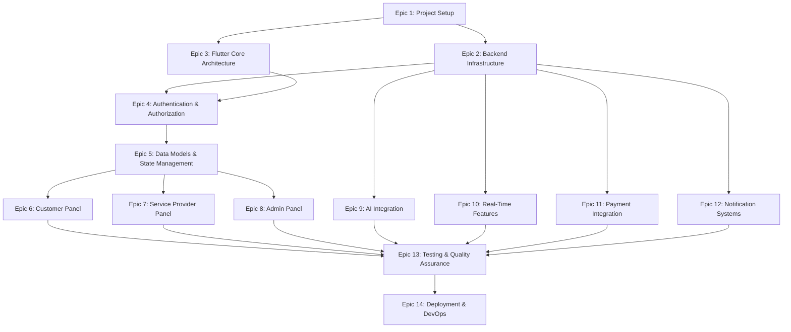

# Task List: Multi-Panel Flutter Application

## Task Dependency Graph



## Epic 1: Project Setup and Configuration

### Task 1.1: Initialize Flutter Project Structure
**Description:** Set up the base Flutter project with proper folder structure and configuration files.
**Requirements:** N/A (Foundation)
**Estimated Time:** 4 hours

#### Sub-task 1.1.1: Create Flutter project with multi-platform support
**Description:** Initialize Flutter project with web and mobile platform support enabled.
**Estimated Time:** 1 hour
**Commands:**
```bash
flutter create --platforms=android,ios,web gharsewa_app
cd gharsewa_app
```

#### Sub-task 1.1.2: Set up project folder structure
**Description:** Create organized folder structure for panels, services, models, and shared components.
**Estimated Time:** 1 hour
**Folder Structure:**
```
lib/
├── core/
│   ├── constants/
│   ├── utils/
│   ├── errors/
│   └── config/
├── data/
│   ├── models/
│   ├── repositories/
│   └── datasources/
├── domain/
│   ├── entities/
│   ├── repositories/
│   └── usecases/
├── presentation/
│   ├── panels/
│   │   ├── customer/
│   │   ├── provider/
│   │   └── admin/
│   ├── shared/
│   └── router/
└── services/
    ├── auth/
    ├── api/
    ├── storage/
    └── notification/
```


#### Sub-task 1.1.3: Configure pubspec.yaml with dependencies
**Description:** Add all required Flutter dependencies for the project.
**Estimated Time:** 1.5 hours
**Dependencies:**
- go_router: ^13.0.0
- flutter_riverpod: ^2.4.0
- dio: ^5.4.0
- hive_flutter: ^1.1.0
- flutter_secure_storage: ^9.0.0
- jwt_decoder: ^2.0.1
- cached_network_image: ^3.3.0
- firebase_core: ^2.24.0
- firebase_messaging: ^14.7.0

#### Sub-task 1.1.4: Set up environment configuration files
**Description:** Create .env files for different environments (dev, staging, prod).
**Estimated Time:** 0.5 hours

### Task 1.2: Configure Build Settings
**Description:** Configure platform-specific build settings and app identifiers.
**Requirements:** N/A (Foundation)
**Estimated Time:** 3 hours

#### Sub-task 1.2.1: Configure Android build settings
**Description:** Update Android manifest, build.gradle, and app identifiers.
**Estimated Time:** 1 hour

#### Sub-task 1.2.2: Configure iOS build settings
**Description:** Update Info.plist, Runner.xcodeproj, and app identifiers.
**Estimated Time:** 1 hour

#### Sub-task 1.2.3: Configure web build settings
**Description:** Update index.html, web manifest, and favicon.
**Estimated Time:** 1 hour

### Task 1.3: Set Up Version Control and CI/CD
**Description:** Initialize Git repository and set up basic CI/CD pipeline.
**Requirements:** N/A (Foundation)
**Estimated Time:** 2 hours

#### Sub-task 1.3.1: Initialize Git repository with .gitignore
**Description:** Create Git repository and configure .gitignore for Flutter project.
**Estimated Time:** 0.5 hours

#### Sub-task 1.3.2: Set up GitHub Actions workflow
**Description:** Create basic CI workflow for build and test automation.
**Estimated Time:** 1.5 hours

## Epic 2: Backend Infrastructure (Laravel + Docker)

### Task 2.1: Initialize Laravel Project
**Description:** Set up Laravel backend project with proper structure.
**Requirements:** Requirement 12 (Laravel Backend API)
**Estimated Time:** 3 hours

#### Sub-task 2.1.1: Create Laravel project
**Description:** Initialize new Laravel project with required structure.
**Estimated Time:** 0.5 hours
**Commands:**
```bash
composer create-project laravel/laravel gharsewa-backend
cd gharsewa-backend
```


#### Sub-task 2.1.2: Install Laravel dependencies
**Description:** Install required Laravel packages (JWT, CORS, Sanctum, etc.).
**Estimated Time:** 1 hour
**Packages:**
- tymon/jwt-auth
- laravel/sanctum
- spatie/laravel-permission
- predis/predis

#### Sub-task 2.1.3: Configure Laravel environment
**Description:** Set up .env file with database, cache, and queue configurations.
**Estimated Time:** 0.5 hours

#### Sub-task 2.1.4: Set up Laravel folder structure
**Description:** Organize controllers, models, services, and repositories.
**Estimated Time:** 1 hour

### Task 2.2: Docker Configuration
**Description:** Create Docker containers for Laravel, MySQL, Redis, and Nginx.
**Requirements:** Requirement 13 (Docker Containerization)
**Estimated Time:** 4 hours

#### Sub-task 2.2.1: Create Dockerfile for Laravel application
**Description:** Write Dockerfile with PHP, Composer, and Laravel dependencies.
**Estimated Time:** 1.5 hours

#### Sub-task 2.2.2: Create docker-compose.yml
**Description:** Configure multi-container setup with Laravel, MySQL, Redis, Nginx.
**Estimated Time:** 1.5 hours
**Services:**
- app (Laravel)
- db (MySQL 8.0)
- redis (Redis 7)
- nginx (Nginx latest)
- websocket (Laravel WebSockets)

#### Sub-task 2.2.3: Create Nginx configuration
**Description:** Configure Nginx as reverse proxy for Laravel application.
**Estimated Time:** 0.5 hours

#### Sub-task 2.2.4: Test Docker setup
**Description:** Build and run Docker containers, verify all services are working.
**Estimated Time:** 0.5 hours

### Task 2.3: Database Schema Design
**Description:** Design and implement database schema for all entities.
**Requirements:** Requirements 1, 4, 5, 6, 7, 8, 9, 10, 11
**Estimated Time:** 4 hours

#### Sub-task 2.3.1: Create users table migration
**Description:** Create migration for users table with role-based fields.
**Estimated Time:** 1 hour
**Fields:** id, email, name, password, role, phone_number, profile_image_url, is_active, created_at, updated_at

#### Sub-task 2.3.2: Create services table migration
**Description:** Create migration for services table.
**Estimated Time:** 1 hour
**Fields:** id, provider_id, name, description, category, price, currency, duration_minutes, status, created_at, updated_at


#### Sub-task 2.3.3: Create bookings table migration
**Description:** Create migration for bookings table.
**Estimated Time:** 1 hour
**Fields:** id, customer_id, service_id, provider_id, scheduled_at, status, total_price, currency, cancellation_reason, created_at, updated_at

#### Sub-task 2.3.4: Create supporting tables migrations
**Description:** Create migrations for service_images, notifications, payments, reviews tables.
**Estimated Time:** 1 hour

### Task 2.4: Laravel API Routes and Controllers
**Description:** Set up RESTful API routes and base controllers.
**Requirements:** Requirement 12 (Laravel Backend API)
**Estimated Time:** 3 hours

#### Sub-task 2.4.1: Define API routes structure
**Description:** Create routes/api.php with versioned API routes.
**Estimated Time:** 1 hour
**Route Groups:**
- /api/v1/auth
- /api/v1/customer
- /api/v1/provider
- /api/v1/admin
- /api/v1/services
- /api/v1/bookings

#### Sub-task 2.4.2: Create base API controller
**Description:** Create BaseController with standard response methods.
**Estimated Time:** 1 hour

#### Sub-task 2.4.3: Set up API middleware
**Description:** Configure authentication, rate limiting, and CORS middleware.
**Estimated Time:** 1 hour

## Epic 3: Flutter Core Architecture

### Task 3.1: Implement Platform Detection
**Description:** Create platform detection utility for web/mobile routing.
**Requirements:** Requirement 3 (Platform Detection and Compatibility)
**Estimated Time:** 2 hours

#### Sub-task 3.1.1: Create PlatformDetector utility class
**Description:** Implement platform detection logic using dart:io and kIsWeb.
**Estimated Time:** 1 hour

#### Sub-task 3.1.2: Create PlatformConfig class
**Description:** Define platform-specific configurations and capabilities.
**Estimated Time:** 1 hour

### Task 3.2: Implement App Router
**Description:** Set up go_router with role-based navigation and deep linking.
**Requirements:** Requirement 2 (Role-Based Panel Navigation)
**Estimated Time:** 4 hours

#### Sub-task 3.2.1: Define route constants and paths
**Description:** Create constants file with all route paths for the application.
**Estimated Time:** 0.5 hours

#### Sub-task 3.2.2: Implement AppRouter class
**Description:** Create AppRouter with go_router configuration and guards.
**Estimated Time:** 2 hours


#### Sub-task 3.2.3: Implement route guards for role-based access
**Description:** Create navigation guards that check user roles and permissions.
**Estimated Time:** 1 hour

#### Sub-task 3.2.4: Add deep linking support
**Description:** Configure deep linking for mobile and web platforms.
**Estimated Time:** 0.5 hours

### Task 3.3: Implement Panel Manager
**Description:** Create PanelManager for managing panel lifecycle and switching.
**Requirements:** Requirement 2 (Role-Based Panel Navigation)
**Estimated Time:** 3 hours

#### Sub-task 3.3.1: Create PanelManager class
**Description:** Implement panel lifecycle management logic.
**Estimated Time:** 1.5 hours

#### Sub-task 3.3.2: Create PanelConfig classes
**Description:** Define configuration classes for each panel type.
**Estimated Time:** 1 hour

#### Sub-task 3.3.3: Implement panel switching logic
**Description:** Add panel disposal and initialization logic with resource cleanup.
**Estimated Time:** 0.5 hours

### Task 3.4: Set Up Theme System
**Description:** Create theme system with support for multiple themes and panels.
**Requirements:** N/A (Foundation)
**Estimated Time:** 3 hours

#### Sub-task 3.4.1: Create AppTheme class
**Description:** Define base theme with colors, typography, and component themes.
**Estimated Time:** 1.5 hours

#### Sub-task 3.4.2: Create panel-specific themes
**Description:** Define themes for Customer, Provider, and Admin panels.
**Estimated Time:** 1 hour

#### Sub-task 3.4.3: Implement theme provider
**Description:** Create Riverpod provider for theme management.
**Estimated Time:** 0.5 hours

## Epic 4: Authentication & Authorization

### Task 4.1: Implement Firebase Authentication (Backend)
**Description:** Configure Firebase Admin SDK in Laravel to verify Firebase ID tokens.
**Requirements:** Requirement 1 (User Authentication and Authorization)
**Estimated Time:** 4 hours

#### Sub-task 4.1.1: Install Firebase Admin SDK in Laravel
**Description:** Install kreait/firebase-php package for Firebase Admin SDK.
**Estimated Time:** 1 hour
```bash
composer require kreait/firebase-php
composer require kreait/laravel-firebase
```

#### Sub-task 4.1.2: Create Firebase token verification middleware
**Description:** Implement Laravel middleware that verifies Firebase ID tokens on every protected request.
**Estimated Time:** 1.5 hours
```php
// Middleware verifies Firebase ID token from Authorization header
// Extracts user UID and custom claims (role)
// Attaches user info to request
```

#### Sub-task 4.1.3: Create Firebase Cloud Function for role assignment
**Description:** Write Cloud Function that sets custom claims (role) when a new user registers.
**Estimated Time:** 1 hour
```javascript
// onUserCreate: sets default role = 'customer'
// setUserRole: admin callable function to change roles
```

#### Sub-task 4.1.4: Implement role-based authorization middleware
**Description:** Create middleware that checks Firebase custom claims for role-based access.
**Estimated Time:** 0.5 hours


### Task 4.2: Implement Flutter Firebase Authentication Service
**Description:** Create authentication service in Flutter using Firebase Auth SDK.
**Requirements:** Requirement 1 (User Authentication and Authorization)
**Estimated Time:** 4 hours

#### Sub-task 4.2.1: Create AuthenticationService using Firebase Auth
**Description:** Implement authentication service wrapping FirebaseAuth with login, logout, and token management.
**Estimated Time:** 2 hours
```dart
// Uses FirebaseAuth.instance
// signInWithEmailAndPassword()
// createUserWithEmailAndPassword()
// signOut()
// currentUser.getIdToken() for API calls
```

#### Sub-task 4.2.2: Implement secure token storage
**Description:** Cache Firebase ID token in flutter_secure_storage; refresh automatically via Firebase SDK.
**Estimated Time:** 1 hour

#### Sub-task 4.2.3: Create authentication state provider
**Description:** Implement Riverpod provider that listens to FirebaseAuth.instance.authStateChanges() stream.
**Estimated Time:** 1 hour

### Task 4.3: Create Login UI
**Description:** Build login screen with role selection and form validation.
**Requirements:** Requirement 1 (User Authentication and Authorization)
**Estimated Time:** 3 hours

#### Sub-task 4.3.1: Create LoginScreen widget
**Description:** Build login UI with email, password fields, and role selector.
**Estimated Time:** 1.5 hours

#### Sub-task 4.3.2: Implement form validation
**Description:** Add email and password validation logic.
**Estimated Time:** 0.5 hours

#### Sub-task 4.3.3: Connect login UI to AuthenticationService
**Description:** Wire up login form to authentication service and handle responses.
**Estimated Time:** 1 hour

### Task 4.4: Implement Token Refresh Logic
**Description:** Firebase handles token refresh automatically. Configure Dio interceptor to always send fresh tokens.
**Requirements:** Requirement 1 (User Authentication and Authorization)
**Estimated Time:** 2 hours

#### Sub-task 4.4.1: Create Firebase token interceptor for Dio
**Description:** Implement Dio interceptor that calls user.getIdToken() before every API request to always send a fresh Firebase ID token.
**Estimated Time:** 1.5 hours
```dart
// On each request: attach Authorization: Bearer <firebase_id_token>
// Firebase SDK auto-refreshes token if expired (every 1 hour)
// On 401 response: force token refresh with getIdToken(true)
```

#### Sub-task 4.4.2: Handle token expiry and unauthenticated scenarios
**Description:** Redirect to login screen when Firebase session is fully expired or revoked.
**Estimated Time:** 0.5 hours

## Epic 5: Data Models & State Management

### Task 5.1: Create Flutter Data Models
**Description:** Implement all data models with JSON serialization.
**Requirements:** All requirements (data models used throughout)
**Estimated Time:** 4 hours

#### Sub-task 5.1.1: Create User model
**Description:** Implement User model with fromJson/toJson methods.
**Estimated Time:** 1 hour

#### Sub-task 5.1.2: Create Service model
**Description:** Implement Service model with fromJson/toJson methods.
**Estimated Time:** 1 hour

#### Sub-task 5.1.3: Create Booking model
**Description:** Implement Booking model with fromJson/toJson methods.
**Estimated Time:** 1 hour


#### Sub-task 5.1.4: Create supporting models
**Description:** Implement AuthenticationState, PanelConfig, and other supporting models.
**Estimated Time:** 1 hour

### Task 5.2: Implement API Client
**Description:** Create API client with Dio for backend communication.
**Requirements:** Requirement 12 (Laravel Backend API)
**Estimated Time:** 3 hours

#### Sub-task 5.2.1: Create ApiClient class
**Description:** Implement base API client with Dio configuration.
**Estimated Time:** 1.5 hours

#### Sub-task 5.2.2: Add request/response interceptors
**Description:** Implement interceptors for auth tokens, logging, and error handling.
**Estimated Time:** 1 hour

#### Sub-task 5.2.3: Create API endpoints constants
**Description:** Define all API endpoint paths as constants.
**Estimated Time:** 0.5 hours

### Task 5.3: Implement Repositories
**Description:** Create repository pattern for data access.
**Requirements:** All requirements (data access layer)
**Estimated Time:** 4 hours

#### Sub-task 5.3.1: Create UserRepository
**Description:** Implement repository for user-related API calls.
**Estimated Time:** 1 hour

#### Sub-task 5.3.2: Create ServiceRepository
**Description:** Implement repository for service-related API calls.
**Estimated Time:** 1 hour

#### Sub-task 5.3.3: Create BookingRepository
**Description:** Implement repository for booking-related API calls.
**Estimated Time:** 1 hour

#### Sub-task 5.3.4: Create repository providers
**Description:** Set up Riverpod providers for all repositories.
**Estimated Time:** 1 hour

### Task 5.4: Implement Local Storage
**Description:** Set up Hive for local data caching and offline support.
**Requirements:** Requirement 24 (Data Synchronization and Offline Support)
**Estimated Time:** 3 hours

#### Sub-task 5.4.1: Initialize Hive and create adapters
**Description:** Set up Hive and create type adapters for models.
**Estimated Time:** 1.5 hours

#### Sub-task 5.4.2: Create LocalStorageService
**Description:** Implement service for local data storage operations.
**Estimated Time:** 1 hour

#### Sub-task 5.4.3: Implement cache synchronization logic
**Description:** Add logic to sync local cache with server data.
**Estimated Time:** 0.5 hours

## Epic 6: Customer Panel Implementation

### Task 6.1: Create Customer Panel Structure
**Description:** Set up base structure for customer panel with navigation.
**Requirements:** Requirement 4, 5 (Customer features)
**Estimated Time:** 3 hours


#### Sub-task 6.1.1: Create CustomerPanel widget
**Description:** Build main customer panel widget with bottom navigation.
**Estimated Time:** 1.5 hours

#### Sub-task 6.1.2: Set up customer routes
**Description:** Define routes for customer screens (home, bookings, profile).
**Estimated Time:** 1 hour

#### Sub-task 6.1.3: Create customer navigation bar
**Description:** Build bottom navigation bar for customer panel.
**Estimated Time:** 0.5 hours

### Task 6.2: Implement Service Browsing
**Description:** Create service listing and search functionality.
**Requirements:** Requirement 4 (Customer Service Browsing and Search)
**Estimated Time:** 4 hours

#### Sub-task 6.2.1: Create ServiceListScreen
**Description:** Build screen to display list of available services.
**Estimated Time:** 1.5 hours

#### Sub-task 6.2.2: Implement service search
**Description:** Add search bar with real-time filtering.
**Estimated Time:** 1 hour

#### Sub-task 6.2.3: Add service filters
**Description:** Implement filters for category, price range, and availability.
**Estimated Time:** 1 hour

#### Sub-task 6.2.4: Create ServiceCard widget
**Description:** Build reusable card widget for displaying service information.
**Estimated Time:** 0.5 hours

### Task 6.3: Implement Service Details
**Description:** Create detailed service view with booking option.
**Requirements:** Requirement 4, 5 (Service browsing and booking)
**Estimated Time:** 3 hours

#### Sub-task 6.3.1: Create ServiceDetailScreen
**Description:** Build screen showing full service details and images.
**Estimated Time:** 1.5 hours

#### Sub-task 6.3.2: Add image gallery
**Description:** Implement image carousel for service images.
**Estimated Time:** 1 hour

#### Sub-task 6.3.3: Add booking button and navigation
**Description:** Add "Book Now" button that navigates to booking screen.
**Estimated Time:** 0.5 hours

### Task 6.4: Implement Booking Creation
**Description:** Create booking flow with date/time selection and confirmation.
**Requirements:** Requirement 5 (Customer Booking Management)
**Estimated Time:** 4 hours

#### Sub-task 6.4.1: Create BookingScreen
**Description:** Build screen with date/time picker and booking form.
**Estimated Time:** 2 hours

#### Sub-task 6.4.2: Implement time slot availability check
**Description:** Add logic to check and display available time slots.
**Estimated Time:** 1 hour


#### Sub-task 6.4.3: Implement booking confirmation
**Description:** Add confirmation dialog and booking submission logic.
**Estimated Time:** 1 hour

### Task 6.5: Implement Booking Management
**Description:** Create screens for viewing and managing bookings.
**Requirements:** Requirement 5 (Customer Booking Management)
**Estimated Time:** 4 hours

#### Sub-task 6.5.1: Create BookingsListScreen
**Description:** Build screen displaying all customer bookings with status.
**Estimated Time:** 1.5 hours

#### Sub-task 6.5.2: Implement booking filters
**Description:** Add filters for booking status (pending, confirmed, completed).
**Estimated Time:** 1 hour

#### Sub-task 6.5.3: Create BookingDetailScreen
**Description:** Build screen showing detailed booking information.
**Estimated Time:** 1 hour

#### Sub-task 6.5.4: Implement booking cancellation
**Description:** Add cancellation functionality with confirmation dialog.
**Estimated Time:** 0.5 hours

### Task 6.6: Implement Customer Profile
**Description:** Create customer profile screen with edit functionality.
**Requirements:** Requirement 1 (User management)
**Estimated Time:** 3 hours

#### Sub-task 6.6.1: Create ProfileScreen
**Description:** Build screen displaying customer profile information.
**Estimated Time:** 1.5 hours

#### Sub-task 6.6.2: Implement profile editing
**Description:** Add form for editing profile details.
**Estimated Time:** 1 hour

#### Sub-task 6.6.3: Add profile image upload
**Description:** Implement image picker and upload functionality.
**Estimated Time:** 0.5 hours

## Epic 7: Service Provider Panel Implementation

### Task 7.1: Create Service Provider Panel Structure
**Description:** Set up base structure for provider panel with navigation.
**Requirements:** Requirement 6, 7, 8 (Provider features)
**Estimated Time:** 3 hours

#### Sub-task 7.1.1: Create ServiceProviderPanel widget
**Description:** Build main provider panel widget with bottom navigation.
**Estimated Time:** 1.5 hours

#### Sub-task 7.1.2: Set up provider routes
**Description:** Define routes for provider screens (dashboard, bookings, services).
**Estimated Time:** 1 hour

#### Sub-task 7.1.3: Create provider navigation bar
**Description:** Build bottom navigation bar for provider panel.
**Estimated Time:** 0.5 hours

### Task 7.2: Implement Provider Dashboard
**Description:** Create dashboard with key metrics and analytics.
**Requirements:** Requirement 6 (Service Provider Dashboard)
**Estimated Time:** 4 hours


#### Sub-task 7.2.1: Create DashboardScreen
**Description:** Build dashboard layout with metric cards.
**Estimated Time:** 1.5 hours

#### Sub-task 7.2.2: Implement earnings display
**Description:** Add widget showing current month earnings.
**Estimated Time:** 1 hour

#### Sub-task 7.2.3: Add booking statistics
**Description:** Display pending, confirmed, and completed booking counts.
**Estimated Time:** 1 hour

#### Sub-task 7.2.4: Implement bookings chart
**Description:** Add chart showing bookings over time using fl_chart package.
**Estimated Time:** 0.5 hours

### Task 7.3: Implement Booking Request Management
**Description:** Create screens for managing incoming booking requests.
**Requirements:** Requirement 7 (Service Provider Booking Management)
**Estimated Time:** 4 hours

#### Sub-task 7.3.1: Create BookingRequestsScreen
**Description:** Build screen displaying pending booking requests.
**Estimated Time:** 1.5 hours

#### Sub-task 7.3.2: Implement accept/reject actions
**Description:** Add buttons and logic for accepting or rejecting bookings.
**Estimated Time:** 1.5 hours

#### Sub-task 7.3.3: Add rejection reason dialog
**Description:** Create dialog for entering rejection reason.
**Estimated Time:** 0.5 hours

#### Sub-task 7.3.4: Implement booking completion
**Description:** Add functionality to mark bookings as completed.
**Estimated Time:** 0.5 hours

### Task 7.4: Implement Service Management
**Description:** Create screens for managing service offerings.
**Requirements:** Requirement 8 (Service Provider Service Management)
**Estimated Time:** 4 hours

#### Sub-task 7.4.1: Create ServicesListScreen
**Description:** Build screen displaying provider's services.
**Estimated Time:** 1 hour

#### Sub-task 7.4.2: Create AddServiceScreen
**Description:** Build form for creating new services.
**Estimated Time:** 1.5 hours

#### Sub-task 7.4.3: Implement service editing
**Description:** Add functionality to edit existing services.
**Estimated Time:** 1 hour

#### Sub-task 7.4.4: Add service activation/deactivation
**Description:** Implement toggle for activating/deactivating services.
**Estimated Time:** 0.5 hours

### Task 7.5: Implement Provider Analytics
**Description:** Create analytics screen with detailed performance metrics.
**Requirements:** Requirement 6 (Service Provider Dashboard)
**Estimated Time:** 3 hours


#### Sub-task 7.5.1: Create AnalyticsScreen
**Description:** Build screen with detailed analytics and charts.
**Estimated Time:** 1.5 hours

#### Sub-task 7.5.2: Implement date range selector
**Description:** Add date range picker for filtering analytics.
**Estimated Time:** 1 hour

#### Sub-task 7.5.3: Add revenue breakdown chart
**Description:** Display revenue breakdown by service category.
**Estimated Time:** 0.5 hours

## Epic 8: Admin Panel Implementation

### Task 8.1: Create Admin Panel Structure
**Description:** Set up base structure for admin web dashboard.
**Requirements:** Requirement 9, 10, 11 (Admin features)
**Estimated Time:** 3 hours

#### Sub-task 8.1.1: Create AdminPanel widget
**Description:** Build main admin panel widget with sidebar navigation.
**Estimated Time:** 1.5 hours

#### Sub-task 8.1.2: Set up admin routes
**Description:** Define routes for admin screens (dashboard, users, bookings).
**Estimated Time:** 1 hour

#### Sub-task 8.1.3: Create admin sidebar navigation
**Description:** Build responsive sidebar navigation for web.
**Estimated Time:** 0.5 hours

### Task 8.2: Implement Admin Dashboard
**Description:** Create comprehensive dashboard with platform statistics.
**Requirements:** Requirement 9 (Admin Platform Overview)
**Estimated Time:** 4 hours

#### Sub-task 8.2.1: Create AdminDashboardScreen
**Description:** Build dashboard layout with statistics cards.
**Estimated Time:** 1.5 hours

#### Sub-task 8.2.2: Implement platform metrics
**Description:** Display total users, bookings, and revenue metrics.
**Estimated Time:** 1 hour

#### Sub-task 8.2.3: Add growth charts
**Description:** Implement charts for user growth and booking trends.
**Estimated Time:** 1 hour

#### Sub-task 8.2.4: Add recent activities feed
**Description:** Display recent platform activities in a timeline.
**Estimated Time:** 0.5 hours

### Task 8.3: Implement User Management
**Description:** Create screens for managing users (customers and providers).
**Requirements:** Requirement 10 (Admin User Management)
**Estimated Time:** 4 hours

#### Sub-task 8.3.1: Create UsersListScreen
**Description:** Build screen with searchable user list and filters.
**Estimated Time:** 1.5 hours

#### Sub-task 8.3.2: Implement user search
**Description:** Add search functionality with real-time filtering.
**Estimated Time:** 1 hour


#### Sub-task 8.3.3: Create UserDetailScreen
**Description:** Build screen showing detailed user information and history.
**Estimated Time:** 1 hour

#### Sub-task 8.3.4: Implement user actions
**Description:** Add activate/deactivate and password reset functionality.
**Estimated Time:** 0.5 hours

### Task 8.4: Implement Booking Oversight
**Description:** Create screens for viewing and managing all bookings.
**Requirements:** Requirement 11 (Admin Booking Oversight)
**Estimated Time:** 4 hours

#### Sub-task 8.4.1: Create AdminBookingsScreen
**Description:** Build screen with comprehensive booking list and filters.
**Estimated Time:** 1.5 hours

#### Sub-task 8.4.2: Implement booking search and filters
**Description:** Add search by ID, customer, provider, and status filters.
**Estimated Time:** 1 hour

#### Sub-task 8.4.3: Create BookingDetailModal
**Description:** Build modal showing detailed booking information.
**Estimated Time:** 1 hour

#### Sub-task 8.4.4: Implement admin booking actions
**Description:** Add functionality to cancel bookings and add notes.
**Estimated Time:** 0.5 hours

### Task 8.5: Implement Reports Generation
**Description:** Create report generation and export functionality.
**Requirements:** Requirement 9 (Admin Platform Overview)
**Estimated Time:** 3 hours

#### Sub-task 8.5.1: Create ReportsScreen
**Description:** Build screen with report type selection and parameters.
**Estimated Time:** 1.5 hours

#### Sub-task 8.5.2: Implement CSV export
**Description:** Add functionality to export reports as CSV files.
**Estimated Time:** 1 hour

#### Sub-task 8.5.3: Implement PDF export
**Description:** Add functionality to export reports as PDF files.
**Estimated Time:** 0.5 hours

## Epic 9: AI Integration

### Task 9.1: Set Up AI Service Infrastructure
**Description:** Configure AI service integration in Laravel backend.
**Requirements:** Requirement 14, 15, 16, 17 (AI features)
**Estimated Time:** 4 hours

#### Sub-task 9.1.1: Install AI SDK packages
**Description:** Install OpenAI SDK or similar multi-model AI packages.
**Estimated Time:** 1 hour

#### Sub-task 9.1.2: Create AIService class
**Description:** Implement base AI service with model configuration.
**Estimated Time:** 1.5 hours

#### Sub-task 9.1.3: Set up AI API credentials
**Description:** Configure environment variables for AI API keys.
**Estimated Time:** 0.5 hours


#### Sub-task 9.1.4: Create AI job queue
**Description:** Set up Laravel queue for processing AI tasks asynchronously.
**Estimated Time:** 1 hour

### Task 9.2: Implement Recommendation Engine
**Description:** Create AI-powered service recommendation system.
**Requirements:** Requirement 14 (Multi-Model AI Integration for Recommendations)
**Estimated Time:** 4 hours

#### Sub-task 9.2.1: Create RecommendationService
**Description:** Implement service for generating personalized recommendations.
**Estimated Time:** 2 hours

#### Sub-task 9.2.2: Implement recommendation API endpoint
**Description:** Create endpoint for fetching recommendations.
**Estimated Time:** 1 hour

#### Sub-task 9.2.3: Integrate recommendations in customer UI
**Description:** Add recommendations section to customer home screen.
**Estimated Time:** 1 hour

### Task 9.3: Implement Service Matching
**Description:** Create AI-powered customer-provider matching system.
**Requirements:** Requirement 15 (AI-Powered Service Matching)
**Estimated Time:** 4 hours

#### Sub-task 9.3.1: Create MatchingService
**Description:** Implement matching algorithm with AI scoring.
**Estimated Time:** 2 hours

#### Sub-task 9.3.2: Implement matching API endpoint
**Description:** Create endpoint for getting match scores.
**Estimated Time:** 1 hour

#### Sub-task 9.3.3: Display match scores in provider UI
**Description:** Show match scores and suggestions in provider dashboard.
**Estimated Time:** 1 hour

### Task 9.4: Implement Predictive Analytics
**Description:** Create AI-driven analytics and forecasting.
**Requirements:** Requirement 16 (AI-Driven Predictive Analytics)
**Estimated Time:** 4 hours

#### Sub-task 9.4.1: Create AnalyticsService
**Description:** Implement predictive analytics using AI models.
**Estimated Time:** 2 hours

#### Sub-task 9.4.2: Implement analytics API endpoints
**Description:** Create endpoints for predictions and anomaly detection.
**Estimated Time:** 1 hour

#### Sub-task 9.4.3: Integrate analytics in admin dashboard
**Description:** Display predictions and insights in admin panel.
**Estimated Time:** 1 hour

### Task 9.5: Implement Smart Notifications
**Description:** Create AI-optimized notification timing and content.
**Requirements:** Requirement 17 (AI-Automated Notifications and Reminders)
**Estimated Time:** 3 hours


#### Sub-task 9.5.1: Create SmartNotificationService
**Description:** Implement AI-based notification timing optimization.
**Estimated Time:** 1.5 hours

#### Sub-task 9.5.2: Implement notification scheduling
**Description:** Create scheduler that uses AI predictions for timing.
**Estimated Time:** 1 hour

#### Sub-task 9.5.3: Add A/B testing framework
**Description:** Implement framework for testing notification strategies.
**Estimated Time:** 0.5 hours

## Epic 10: Real-Time Features

### Task 10.1: Set Up WebSocket Server
**Description:** Configure Laravel WebSockets for real-time communication.
**Requirements:** Requirement 18 (Real-Time Features with WebSockets)
**Estimated Time:** 4 hours

#### Sub-task 10.1.1: Install Laravel WebSockets package
**Description:** Install and configure beyondcode/laravel-websockets.
**Estimated Time:** 1 hour

#### Sub-task 10.1.2: Configure WebSocket server
**Description:** Set up WebSocket server configuration and ports.
**Estimated Time:** 1.5 hours

#### Sub-task 10.1.3: Create WebSocket authentication
**Description:** Implement JWT-based WebSocket authentication.
**Estimated Time:** 1 hour

#### Sub-task 10.1.4: Add WebSocket to Docker
**Description:** Update docker-compose to include WebSocket service.
**Estimated Time:** 0.5 hours

### Task 10.2: Implement Real-Time Events
**Description:** Create Laravel events and broadcasting for real-time updates.
**Requirements:** Requirement 18 (Real-Time Features with WebSockets)
**Estimated Time:** 3 hours

#### Sub-task 10.2.1: Create booking status events
**Description:** Implement events for booking status changes.
**Estimated Time:** 1 hour

#### Sub-task 10.2.2: Create notification events
**Description:** Implement events for new notifications.
**Estimated Time:** 1 hour

#### Sub-task 10.2.3: Create presence channel
**Description:** Set up presence channel for online/offline status.
**Estimated Time:** 1 hour

### Task 10.3: Implement Flutter WebSocket Client
**Description:** Create WebSocket client in Flutter for real-time updates.
**Requirements:** Requirement 18 (Real-Time Features with WebSockets)
**Estimated Time:** 4 hours

#### Sub-task 10.3.1: Install web_socket_channel package
**Description:** Add and configure WebSocket package.
**Estimated Time:** 0.5 hours

#### Sub-task 10.3.2: Create WebSocketService
**Description:** Implement WebSocket connection management service.
**Estimated Time:** 2 hours


#### Sub-task 10.3.3: Implement auto-reconnection logic
**Description:** Add logic to automatically reconnect on connection loss.
**Estimated Time:** 1 hour

#### Sub-task 10.3.4: Create event listeners
**Description:** Implement listeners for booking and notification events.
**Estimated Time:** 0.5 hours

### Task 10.4: Integrate Real-Time Updates in UI
**Description:** Connect WebSocket events to UI components.
**Requirements:** Requirement 18 (Real-Time Features with WebSockets)
**Estimated Time:** 3 hours

#### Sub-task 10.4.1: Add real-time booking updates
**Description:** Update booking lists in real-time when status changes.
**Estimated Time:** 1.5 hours

#### Sub-task 10.4.2: Add real-time notifications
**Description:** Display in-app notifications in real-time.
**Estimated Time:** 1 hour

#### Sub-task 10.4.3: Add presence indicators
**Description:** Show online/offline status for users.
**Estimated Time:** 0.5 hours

## Epic 11: Payment Integration

### Task 11.1: Set Up Payment Gateway
**Description:** Configure payment gateway (Stripe/PayPal) in Laravel.
**Requirements:** Requirement 19 (Payment Integration)
**Estimated Time:** 4 hours

#### Sub-task 11.1.1: Install payment gateway SDK
**Description:** Install Stripe or PayPal SDK for Laravel.
**Estimated Time:** 1 hour

#### Sub-task 11.1.2: Configure payment credentials
**Description:** Set up API keys and webhook endpoints.
**Estimated Time:** 1 hour

#### Sub-task 11.1.3: Create PaymentService
**Description:** Implement payment processing service.
**Estimated Time:** 1.5 hours

#### Sub-task 11.1.4: Set up webhook handlers
**Description:** Create handlers for payment webhooks.
**Estimated Time:** 0.5 hours

### Task 11.2: Implement Payment Processing
**Description:** Create payment processing logic and API endpoints.
**Requirements:** Requirement 19 (Payment Integration)
**Estimated Time:** 4 hours

#### Sub-task 11.2.1: Create payment API endpoints
**Description:** Implement endpoints for payment intent, confirm, refund.
**Estimated Time:** 2 hours

#### Sub-task 11.2.2: Implement payment validation
**Description:** Add validation for payment amounts and methods.
**Estimated Time:** 1 hour

#### Sub-task 11.2.3: Create payment records
**Description:** Implement database storage for payment transactions.
**Estimated Time:** 1 hour


### Task 11.3: Implement Flutter Payment UI
**Description:** Create payment screens and integrate payment SDK.
**Requirements:** Requirement 19 (Payment Integration)
**Estimated Time:** 4 hours

#### Sub-task 11.3.1: Install Flutter payment package
**Description:** Add flutter_stripe or similar payment package.
**Estimated Time:** 0.5 hours

#### Sub-task 11.3.2: Create PaymentScreen
**Description:** Build payment form with card input fields.
**Estimated Time:** 2 hours

#### Sub-task 11.3.3: Implement payment processing
**Description:** Connect payment form to backend API.
**Estimated Time:** 1 hour

#### Sub-task 11.3.4: Add payment confirmation
**Description:** Display payment success/failure messages.
**Estimated Time:** 0.5 hours

### Task 11.4: Implement Refund System
**Description:** Create refund processing for cancelled bookings.
**Requirements:** Requirement 19 (Payment Integration)
**Estimated Time:** 3 hours

#### Sub-task 11.4.1: Create refund API endpoint
**Description:** Implement endpoint for processing refunds.
**Estimated Time:** 1.5 hours

#### Sub-task 11.4.2: Implement refund policy logic
**Description:** Add logic for calculating refund amounts based on policy.
**Estimated Time:** 1 hour

#### Sub-task 11.4.3: Add refund notifications
**Description:** Send notifications when refunds are processed.
**Estimated Time:** 0.5 hours

## Epic 12: Notification Systems

### Task 12.1: Set Up Firebase Cloud Messaging
**Description:** Configure FCM for push notifications.
**Requirements:** Requirement 20 (Push Notification System)
**Estimated Time:** 3 hours

#### Sub-task 12.1.1: Set up Firebase project
**Description:** Create Firebase project and add app configurations.
**Estimated Time:** 1 hour

#### Sub-task 12.1.2: Configure FCM in Flutter
**Description:** Install and configure firebase_messaging package.
**Estimated Time:** 1 hour

#### Sub-task 12.1.3: Implement FCM token management
**Description:** Add logic to register and update device tokens.
**Estimated Time:** 1 hour

### Task 12.2: Implement Push Notifications
**Description:** Create push notification sending and handling.
**Requirements:** Requirement 20 (Push Notification System)
**Estimated Time:** 4 hours

#### Sub-task 12.2.1: Create NotificationService in Laravel
**Description:** Implement service for sending push notifications via FCM.
**Estimated Time:** 2 hours


#### Sub-task 12.2.2: Implement notification handlers in Flutter
**Description:** Add handlers for foreground and background notifications.
**Estimated Time:** 1.5 hours

#### Sub-task 12.2.3: Add notification navigation
**Description:** Implement deep linking from notifications to screens.
**Estimated Time:** 0.5 hours

### Task 12.3: Implement Email Notifications
**Description:** Set up email notification system.
**Requirements:** Requirement 21 (Email Notification System)
**Estimated Time:** 4 hours

#### Sub-task 12.3.1: Configure mail service
**Description:** Set up SMTP or mail service (SendGrid, Mailgun).
**Estimated Time:** 1 hour

#### Sub-task 12.3.2: Create email templates
**Description:** Design HTML email templates for different events.
**Estimated Time:** 1.5 hours

#### Sub-task 12.3.3: Implement email sending service
**Description:** Create service for sending templated emails.
**Estimated Time:** 1 hour

#### Sub-task 12.3.4: Add email preferences
**Description:** Implement user preferences for email notifications.
**Estimated Time:** 0.5 hours

### Task 12.4: Implement SMS Notifications
**Description:** Set up SMS notification system.
**Requirements:** Requirement 22 (SMS Notification System)
**Estimated Time:** 3 hours

#### Sub-task 12.4.1: Configure SMS gateway
**Description:** Set up Twilio or similar SMS service.
**Estimated Time:** 1 hour

#### Sub-task 12.4.2: Create SMS sending service
**Description:** Implement service for sending SMS messages.
**Estimated Time:** 1.5 hours

#### Sub-task 12.4.3: Add SMS preferences
**Description:** Implement user preferences for SMS notifications.
**Estimated Time:** 0.5 hours

### Task 12.5: Implement Notification Preferences
**Description:** Create UI for managing notification preferences.
**Requirements:** Requirement 20, 21, 22 (Notification systems)
**Estimated Time:** 3 hours

#### Sub-task 12.5.1: Create NotificationSettingsScreen
**Description:** Build screen with notification preference toggles.
**Estimated Time:** 1.5 hours

#### Sub-task 12.5.2: Implement preference API
**Description:** Create endpoints for saving notification preferences.
**Estimated Time:** 1 hour

#### Sub-task 12.5.3: Connect UI to backend
**Description:** Wire up settings screen to API.
**Estimated Time:** 0.5 hours


## Epic 13: Testing & Quality Assurance

### Task 13.1: Set Up Testing Infrastructure
**Description:** Configure testing frameworks and tools.
**Requirements:** All requirements (testing validates all features)
**Estimated Time:** 3 hours

#### Sub-task 13.1.1: Configure Flutter test environment
**Description:** Set up flutter_test and integration_test packages.
**Estimated Time:** 1 hour

#### Sub-task 13.1.2: Configure Laravel test environment
**Description:** Set up PHPUnit and Laravel testing configuration.
**Estimated Time:** 1 hour

#### Sub-task 13.1.3: Set up test database
**Description:** Configure separate test database for Laravel tests.
**Estimated Time:** 1 hour

### Task 13.2: Write Unit Tests
**Description:** Create unit tests for core business logic.
**Requirements:** All requirements
**Estimated Time:** 8 hours

#### Sub-task 13.2.1: Write authentication service tests
**Description:** Test login, logout, token refresh functionality.
**Estimated Time:** 2 hours

#### Sub-task 13.2.2: Write repository tests
**Description:** Test all repository methods with mocked API.
**Estimated Time:** 2 hours

#### Sub-task 13.2.3: Write model tests
**Description:** Test model serialization and validation.
**Estimated Time:** 2 hours

#### Sub-task 13.2.4: Write Laravel API tests
**Description:** Test all API endpoints with feature tests.
**Estimated Time:** 2 hours

### Task 13.3: Write Widget Tests
**Description:** Create widget tests for UI components.
**Requirements:** All UI requirements
**Estimated Time:** 6 hours

#### Sub-task 13.3.1: Write login screen tests
**Description:** Test login form validation and submission.
**Estimated Time:** 1.5 hours

#### Sub-task 13.3.2: Write customer panel tests
**Description:** Test customer screens and interactions.
**Estimated Time:** 1.5 hours

#### Sub-task 13.3.3: Write provider panel tests
**Description:** Test provider screens and interactions.
**Estimated Time:** 1.5 hours

#### Sub-task 13.3.4: Write admin panel tests
**Description:** Test admin screens and interactions.
**Estimated Time:** 1.5 hours

### Task 13.4: Write Integration Tests
**Description:** Create end-to-end integration tests.
**Requirements:** All requirements
**Estimated Time:** 6 hours


#### Sub-task 13.4.1: Write authentication flow tests
**Description:** Test complete login to panel navigation flow.
**Estimated Time:** 1.5 hours

#### Sub-task 13.4.2: Write booking flow tests
**Description:** Test complete booking creation and management flow.
**Estimated Time:** 2 hours

#### Sub-task 13.4.3: Write payment flow tests
**Description:** Test complete payment processing flow.
**Estimated Time:** 1.5 hours

#### Sub-task 13.4.4: Write notification flow tests
**Description:** Test notification sending and receiving flow.
**Estimated Time:** 1 hour

### Task 13.5: Implement Performance Testing
**Description:** Set up and run performance tests.
**Requirements:** Requirement 26 (Performance and Scalability)
**Estimated Time:** 4 hours

#### Sub-task 13.5.1: Set up performance monitoring
**Description:** Configure Firebase Performance Monitoring.
**Estimated Time:** 1 hour

#### Sub-task 13.5.2: Write load tests for API
**Description:** Create load tests using Apache JMeter or similar.
**Estimated Time:** 2 hours

#### Sub-task 13.5.3: Profile Flutter app performance
**Description:** Use Flutter DevTools to identify performance bottlenecks.
**Estimated Time:** 1 hour

### Task 13.6: Implement Accessibility Testing
**Description:** Test and ensure accessibility compliance.
**Requirements:** Requirement 28 (Accessibility)
**Estimated Time:** 3 hours

#### Sub-task 13.6.1: Run accessibility audits
**Description:** Use Flutter accessibility tools to audit the app.
**Estimated Time:** 1.5 hours

#### Sub-task 13.6.2: Test with screen readers
**Description:** Test app with TalkBack (Android) and VoiceOver (iOS).
**Estimated Time:** 1 hour

#### Sub-task 13.6.3: Fix accessibility issues
**Description:** Address identified accessibility problems.
**Estimated Time:** 0.5 hours

### Task 13.7: Implement Security Testing
**Description:** Conduct security audits and penetration testing.
**Requirements:** Requirement 25 (Security and Data Protection)
**Estimated Time:** 4 hours

#### Sub-task 13.7.1: Run security audit on API
**Description:** Test for common vulnerabilities (SQL injection, XSS, etc.).
**Estimated Time:** 2 hours

#### Sub-task 13.7.2: Test authentication security
**Description:** Verify token security and session management.
**Estimated Time:** 1 hour

#### Sub-task 13.7.3: Test data encryption
**Description:** Verify data encryption at rest and in transit.
**Estimated Time:** 1 hour


## Epic 14: Deployment & DevOps

### Task 14.1: Set Up Production Environment
**Description:** Configure production servers and infrastructure.
**Requirements:** Requirement 13 (Docker Containerization)
**Estimated Time:** 4 hours

#### Sub-task 14.1.1: Set up production server
**Description:** Configure cloud server (AWS, DigitalOcean, etc.).
**Estimated Time:** 1.5 hours

#### Sub-task 14.1.2: Configure production Docker
**Description:** Set up Docker Compose for production deployment.
**Estimated Time:** 1.5 hours

#### Sub-task 14.1.3: Set up SSL certificates
**Description:** Configure SSL/TLS certificates with Let's Encrypt.
**Estimated Time:** 1 hour

### Task 14.2: Configure CI/CD Pipeline
**Description:** Set up automated build and deployment pipeline.
**Requirements:** N/A (DevOps)
**Estimated Time:** 4 hours

#### Sub-task 14.2.1: Configure GitHub Actions for Flutter
**Description:** Set up automated builds for Android, iOS, and web.
**Estimated Time:** 2 hours

#### Sub-task 14.2.2: Configure GitHub Actions for Laravel
**Description:** Set up automated testing and deployment for backend.
**Estimated Time:** 1.5 hours

#### Sub-task 14.2.3: Set up deployment scripts
**Description:** Create scripts for automated deployment to production.
**Estimated Time:** 0.5 hours

### Task 14.3: Set Up Monitoring and Logging
**Description:** Configure application monitoring and logging.
**Requirements:** Requirement 30 (Analytics and Monitoring)
**Estimated Time:** 4 hours

#### Sub-task 14.3.1: Set up Firebase Crashlytics
**Description:** Configure crash reporting for Flutter app.
**Estimated Time:** 1 hour

#### Sub-task 14.3.2: Set up Laravel logging
**Description:** Configure centralized logging (Papertrail, Loggly, etc.).
**Estimated Time:** 1.5 hours

#### Sub-task 14.3.3: Set up application monitoring
**Description:** Configure APM tool (New Relic, Datadog, etc.).
**Estimated Time:** 1.5 hours

### Task 14.4: Configure Database Backups
**Description:** Set up automated database backup system.
**Requirements:** Requirement 25 (Security and Data Protection)
**Estimated Time:** 2 hours

#### Sub-task 14.4.1: Configure automated backups
**Description:** Set up daily automated database backups.
**Estimated Time:** 1 hour

#### Sub-task 14.4.2: Test backup restoration
**Description:** Verify backup files can be restored successfully.
**Estimated Time:** 1 hour


### Task 14.5: Deploy Flutter Applications
**Description:** Build and deploy Flutter apps to app stores and web.
**Requirements:** N/A (Deployment)
**Estimated Time:** 6 hours

#### Sub-task 14.5.1: Build and deploy Android app
**Description:** Build release APK/AAB and deploy to Google Play Store.
**Estimated Time:** 2 hours

#### Sub-task 14.5.2: Build and deploy iOS app
**Description:** Build release IPA and deploy to Apple App Store.
**Estimated Time:** 2 hours

#### Sub-task 14.5.3: Build and deploy web app
**Description:** Build web release and deploy to hosting service.
**Estimated Time:** 1.5 hours

#### Sub-task 14.5.4: Configure app store listings
**Description:** Create app store descriptions, screenshots, and metadata.
**Estimated Time:** 0.5 hours

### Task 14.6: Set Up Analytics
**Description:** Configure analytics tracking for user behavior.
**Requirements:** Requirement 30 (Analytics and Monitoring)
**Estimated Time:** 3 hours

#### Sub-task 14.6.1: Set up Firebase Analytics
**Description:** Configure Firebase Analytics for Flutter app.
**Estimated Time:** 1 hour

#### Sub-task 14.6.2: Implement event tracking
**Description:** Add analytics events for key user actions.
**Estimated Time:** 1.5 hours

#### Sub-task 14.6.3: Set up analytics dashboard
**Description:** Create custom dashboards for monitoring metrics.
**Estimated Time:** 0.5 hours

### Task 14.7: Documentation and Handover
**Description:** Create comprehensive documentation for the project.
**Requirements:** N/A (Documentation)
**Estimated Time:** 4 hours

#### Sub-task 14.7.1: Write API documentation
**Description:** Document all API endpoints with Swagger/OpenAPI.
**Estimated Time:** 1.5 hours

#### Sub-task 14.7.2: Write deployment guide
**Description:** Create step-by-step deployment documentation.
**Estimated Time:** 1 hour

#### Sub-task 14.7.3: Write user guides
**Description:** Create user documentation for each panel.
**Estimated Time:** 1 hour

#### Sub-task 14.7.4: Create developer onboarding guide
**Description:** Document project structure and development workflow.
**Estimated Time:** 0.5 hours

## Summary

**Total Epics:** 14
**Total Tasks:** 85+
**Total Sub-tasks:** 250+
**Estimated Total Time:** 300+ hours

### Epic Summary:
1. **Epic 1: Project Setup** - 9 hours
2. **Epic 2: Backend Infrastructure** - 15 hours
3. **Epic 3: Flutter Core Architecture** - 12 hours
4. **Epic 4: Authentication & Authorization** - 13 hours
5. **Epic 5: Data Models & State Management** - 14 hours
6. **Epic 6: Customer Panel** - 18 hours
7. **Epic 7: Service Provider Panel** - 18 hours
8. **Epic 8: Admin Panel** - 18 hours
9. **Epic 9: AI Integration** - 19 hours
10. **Epic 10: Real-Time Features** - 14 hours
11. **Epic 11: Payment Integration** - 15 hours
12. **Epic 12: Notification Systems** - 17 hours
13. **Epic 13: Testing & Quality Assurance** - 34 hours
14. **Epic 14: Deployment & DevOps** - 27 hours

**Note:** All sub-tasks are designed to be completed within 2 hours maximum as requested.
